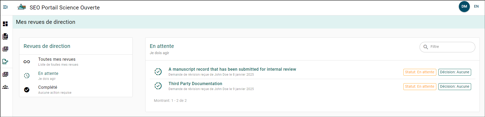
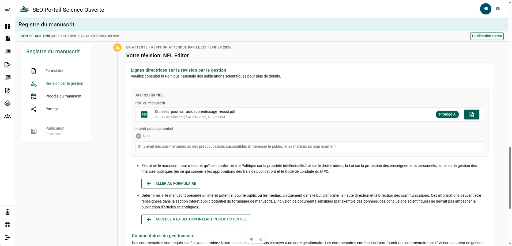
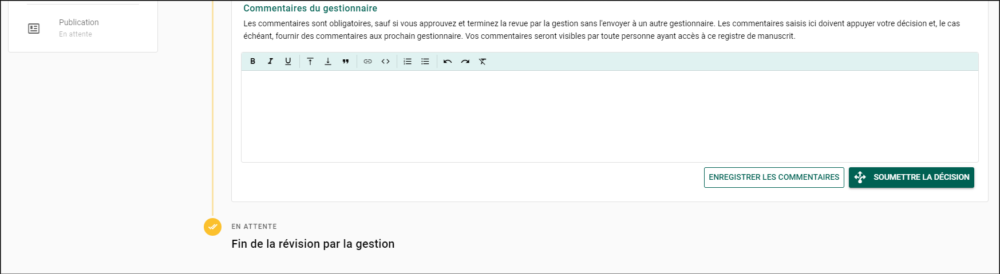
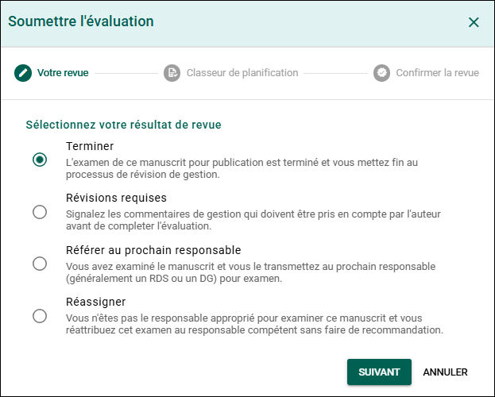
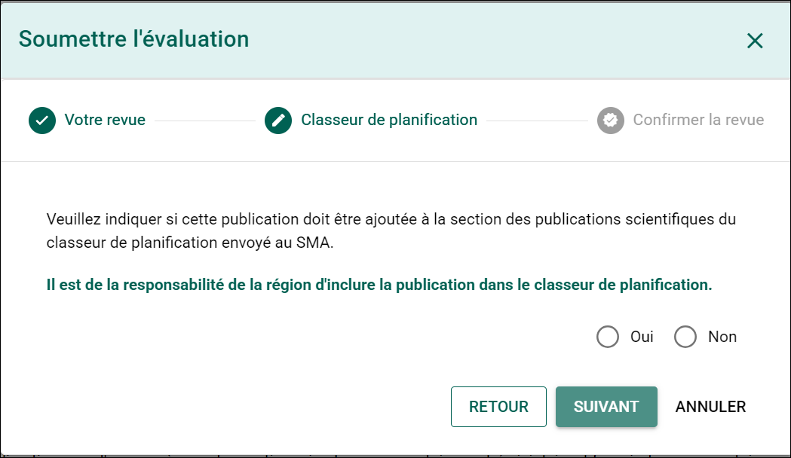
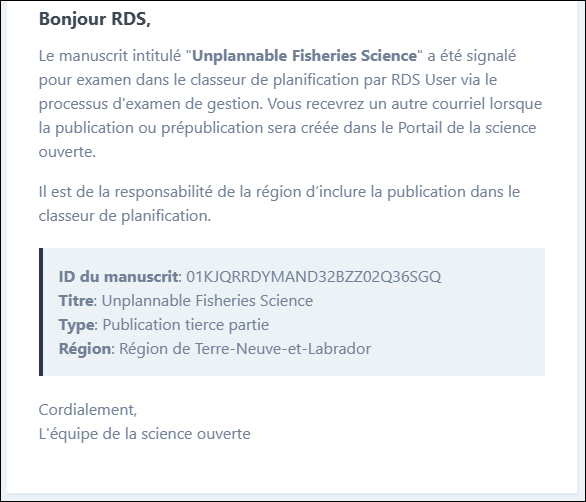
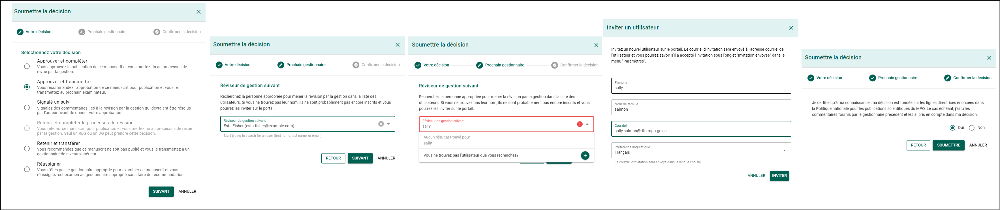

import Tabs from '@theme/Tabs';
import TabItem from '@theme/TabItem';
import TurnaroundMap from '@site/src/components/TurnaroundMap';

# Examen de gestion du manuscrit

## Page Mes examens de gestion des manuscrits {/* #my-manuscript-management-reviews-page */}

Vous pouvez consulter le statut des manuscrits que vous avez examinés ou pour lesquels vous avez été sélectionné comme réviseur dans la page **Mes examens de gestion des manuscrits**.

Pour accéder à la page **Mes examens de gestion des manuscrits** :

1. Développez le menu de sélection des pages en survolant le menu latéral gauche avec votre souris.
2. Sélectionnez **Mes examens de gestion des manuscrits**.

:::note
Dans les cas où l’examen implique des révisions du manuscrit, vous pourriez remarquer que le même manuscrit apparaît pour chaque étape de l’examen. Cela s’explique par le fait que chaque étape possède son propre résultat d’examen suivi.
:::

Dans la page **Mes examens de gestion des manuscrits**, vous verrez une liste de tous les manuscrits en attente de votre examen. Cliquez sur un formulaire de dossier de manuscrit (MRF) en attente pour commencer l’examen.

## Examiner un MRF {/* #reviewing-an-mrf */}

### Votre rôle en tant que gestionnaire réviseur {/* #your-role-as-the-reviewing-manager */}

Examine le manuscrit afin de vérifier sa conformité avec la [Politique sur la propriété intellectuelle/Loi sur le droit d’auteur](https://www.dfo-mpo.gc.ca/terms-avis/copyright-droits-fra.htm), la [Loi sur la protection des renseignements personnels](https://www.priv.gc.ca/fr/sujets-lies-a-la-protection-de-la-vie-privee/lois-sur-la-protection-des-renseignements-personnels-au-canada/la-loi-sur-la-protection-des-renseignements-personnels/lprp_survol/), la Loi sur la gestion des finances publiques (en ce qui concerne l’approbation des coûts de publication) et le [Code de valeurs et d’éthique du MPO](https://intranet.ent.dfo-mpo.ca/hr-rh/fr/node/1172).

Détermine si un manuscrit présente un intérêt public potentiel dans le seul but d’informer les directeurs régionaux des sciences (DRS) et les équipes régionales des Communications du MPO. Les sujets d’intérêt public potentiel peuvent inclure des sujets liés à l’actualité ou présentant un intérêt pour les intervenants. Il peut s’agir d’histoires intéressantes mettant en valeur la recherche du MPO ou d’études plus controversées. La présence de contenu potentiellement sensible n’empêchera jamais la publication d’un manuscrit.

Les auteurs peuvent soumettre leur publication à une revue tierce pour évaluation par les pairs après que le gestionnaire a jugé la publication conforme aux lois, politiques et directives applicables, ou si aucun commentaire n’a été reçu dans les 10 jours ouvrables suivant l’examen de gestion du manuscrit. Les gestionnaires de division, les directeurs du SEO dans la région de la capitale nationale (RCN), les directeurs régionaux des sciences et les directeurs généraux nationaux peuvent effectuer l’examen de gestion du manuscrit.

Pour plus d’information, consultez la [Politique nationale sur les publications scientifiques de Pêches et Océans Canada](https://intranet.ent.dfo-mpo.ca/science/fr/node/1471).

### Échéancier de 10 jours ouvrables {/* #10-working-day-timeline */}

Par souci de commodité, le portail calcule l’échéancier de 10 jours ouvrables lorsque cela s’applique. Toutefois, le portail n’effectue pas automatiquement l’examen des MRF dépassant cette période et les gestionnaires sont tout de même tenus de compléter l’examen, peu importe si le document a été soumis.

<Tabs>

<TabItem value="third-party-journal-publications" label="Publications dans des revues tierces" default>

Si un gestionnaire relève des problèmes liés aux lois, politiques et directives applicables, il doit communiquer avec l’auteur ou les auteurs afin de demander des révisions ou référer la publication au directeur régional des sciences ou au directeur général national approprié. Dans ce cas, l’échéancier de 10 jours ouvrables est suspendu.

Exemples de suspension de l’échéancier :

- Un gestionnaire de division transmet le manuscrit à un DRS ou à un DG.
- Un gestionnaire demande des révisions à l’auteur à la suite de son examen. Dans ce cas, l’échéancier de 10 jours ouvrables recommence lorsque l’auteur répond.
</TabItem>

<TabItem value="dfo-publications" label="Publications du MPO">

Il n’existe pas d’échéancier obligatoire de 10 jours ouvrables pour les publications du MPO. Conformément à la politique, les gestionnaires doivent répondre dans un délai raisonnable.

Le directeur régional des sciences d’une région peut inscrire sa région à un échéancier de 10 jours ouvrables pour les publications du MPO. Les publications du MPO recevront alors une date limite d’examen de 10 jours ouvrables ainsi que des rappels d’échéance et de retard.  
Pour vous inscrire, veuillez envoyer un courriel à l’[équipe de soutien du PSO](mailto:DFO.OpenScience-ScienceOuverte.MPO@dfo-mpo.gc.ca).
</TabItem>

</Tabs>

### Délai facultatif de 10 jours ouvrables par région {/* #optional-10-business-day-turnaround-by-region */}

La carte indique si la région a adopté le délai facultatif de 10 jours ouvrables pour les publications secondaires.

<TurnaroundMap />

### Examiner le formulaire de manuscrit {/* #review-the-manuscript-form */}

:::tip
Pendant que vous êtes le réviseur actuel, vous pouvez modifier le formulaire MRF au besoin.
:::

Le manuscrit et toute section concernant l’intérêt public potentiel peuvent être examinés dans le panneau de révision rapide de la page Examen de gestion du manuscrit.

Pour examiner le formulaire complet du manuscrit :

1. Cliquez sur le bouton **ALLER AU FORMULAIRE DE MANUSCRIT**.
2. Cliquez sur l’icône **Télécharger** pour télécharger une copie PDF du manuscrit.
3. Apportez les modifications nécessaires au dossier du manuscrit. Pour plus d’information, consultez [Remplir un MRF](/publication-process/manuscript-record-form.mdx#complete-the-manuscript-record-form).
4. Cliquez sur le bouton **Examen de gestion du manuscrit** dans le menu latéral pour revenir à la page Examen de gestion du manuscrit.

### Examiner la section Intérêt public potentiel {/* #review-the-potential-public-interest-section */}

Pour accéder directement à la section Intérêt public potentiel du formulaire de manuscrit :

1. Cliquez sur le bouton **ALLER À LA SECTION INTÉRÊT PUBLIC POTENTIEL**.
2. Cliquez sur le bouton **Examen de gestion du manuscrit** dans le menu latéral pour revenir à la page Examen de gestion du manuscrit.

#### Commentaires de gestion {/* #management-comments */}

Si vous prévoyez transférer ou réassigner l’examen de gestion du manuscrit à un autre gestionnaire, ou si vous avez des commentaires que vous souhaitez voir traités par l’auteur, vous devez inscrire vos commentaires dans la zone de texte **Commentaires du gestionnaire**. Ces commentaires seront visibles par toute personne ayant actuellement ou ultérieurement accès à ce dossier de manuscrit.

Si vous avez l’intention d’approuver et de compléter l’examen de gestion du manuscrit, les commentaires ne sont pas obligatoires.

## Actions d’examen de gestion du manuscrit {/* #manuscript-management-review-actions */}
### Décision d’examen {/* #review-decision */}

:::important

- Pour les publications du MPO, seul un DRS, un DG ou un utilisateur ayant reçu le rôle `director` dans le portail peut compléter l’examen de gestion du manuscrit.
- Un commentaire du gestionnaire est requis pour toutes les actions autres que `compléter` l’examen de gestion du manuscrit.

:::

Les décisions de gestion disponibles sont :

- **Compléter**
  :::info
  Pour les publications du MPO, seul un directeur peut effectuer cette action.
  :::
  - Vous avez examiné ce manuscrit pour publication et mettez fin au processus d’examen de gestion du manuscrit.

- **Révision requise**
  - Vous signalez des commentaires d’examen de gestion du manuscrit que l’auteur doit traiter avant que vous puissiez donner votre approbation.

- **Transférer au prochain gestionnaire**
  - Vous avez examiné ce manuscrit et le transférez au prochain gestionnaire (habituellement un DRS ou un DG) pour examen.
  - Cette étape suspend l’échéancier de 10 jours ouvrables pour les manuscrits destinés à des revues tierces et les prépublications.
  :::tip
  Afin d’accélérer le processus d’examen et d’améliorer la transparence, assurez-vous toujours d’inclure des notes et des recommandations claires pour le prochain gestionnaire. Cela est particulièrement important si vous estimez qu’une révision est requise.
  :::

- **Réassigner**
  - Vous n’êtes pas le gestionnaire approprié pour examiner ce manuscrit et réassignez l’examen au bon gestionnaire.
  :::tip
  Si vous êtes un auteur ayant envoyé le manuscrit par erreur au mauvais destinataire pour examen, vous pouvez également communiquer avec l’équipe du portail pour obtenir de l’aide.
  :::

### Cahier de planification {/* #planning-binder */}

Si vous êtes le dernier réviseur, il vous sera demandé si ce manuscrit devrait être considéré comme un élément du cahier de planification du SMA du SEO. Sélectionner **Oui** informe l’équipe de la science ouverte et permet une meilleure visibilité du suivi de ce manuscrit dans le PSO.

:::warning
Sélectionner « Oui » **n’ajoute pas** la publication au cahier de planification !

Il est de la responsabilité de la région d’ajouter la publication au cahier de planification !
:::

### Confirmer l’examen {/* #confirm-review */}

Après avoir examiné le dossier de manuscrit et fourni les commentaires nécessaires, vous pouvez soumettre votre examen.

Pour soumettre un examen de gestion du manuscrit :

1. Cliquez sur le bouton **SOUMETTRE**.
2. Sélectionnez la décision que vous souhaitez prendre et cliquez sur le bouton **SUIVANT**.
3. Si vous transférez l’examen de gestion du manuscrit à un autre gestionnaire :
   - Cliquez dans la boîte de recherche **Prochain réviseur de l’examen de gestion du manuscrit** et saisissez le nom du gestionnaire de division.
   - Si le gestionnaire est présent dans la base de données, son nom apparaîtra. Cliquez sur son nom pour le sélectionner.
   - Si son nom n’apparaît pas, suivez les étapes suivantes pour l’inviter au PSO :
     1. Cliquez sur le bouton **Vous ne trouvez pas l’utilisateur recherché ?**.
     2. Entrez l’**adresse courriel** du gestionnaire et sélectionnez l’utilisateur approprié dans le répertoire du MPO.
     3. Cliquez sur le bouton **INVITER** pour inviter le gestionnaire au PSO.
4. Cliquez sur le bouton **SUIVANT** pour confirmer le gestionnaire sélectionné.
5. Sélectionnez **Oui** et cliquez sur le bouton **SOUMETTRE**.

### Notifications par courriel {/* #email-notifications */}

Le PSO enverra automatiquement un courriel :

- Lorsqu’une action d’examen de gestion du manuscrit est effectuée.
  - Les gestionnaires ayant « Complété » leur examen recevront une copie conforme (CC) de tous les courriels pendant le reste du processus d’examen.
- Une fois par semaine avec un résumé de tous vos examens de gestion des manuscrits en attente.
- Deux jours ouvrables avant que l’échéancier de dix jours ouvrables soit atteint (pour les publications dans des revues tierces)