# Créer un formulaire de dossier de manuscrit

Créez un formulaire de dossier de manuscrit (MRF) afin de commencer le suivi d’une publication dans le Portail de la science ouverte (PSO). Le MRF stocke les détails du manuscrit et soutient le processus d’examen de publication.

:::tip
**Enregistrer votre progression**

Enregistrez fréquemment votre manuscrit afin d’éviter toute perte de travail.

Vous pouvez enregistrer votre progression de deux façons :

- En cliquant sur le bouton circulaire **Disquette** situé dans le coin inférieur droit de la page.
- En faisant défiler la page jusqu’au bas du formulaire et en cliquant sur **Enregistrer**.

Après l’enregistrement, vous pouvez quitter le PSO en toute sécurité.
:::

## Ouvrir la page Mes manuscrits {/* #open-the-my-manuscripts-page */}

La page **Mes manuscrits** répertorie tous les dossiers de manuscrits que vous avez créés ou qui ont été partagés avec vous.

**Étapes**

1. Survolez la barre latérale gauche pour développer le menu de navigation.
2. Cliquez sur **Mes manuscrits**.

**Résultat**

La page **Mes manuscrits** s’affiche et présente tous les dossiers de manuscrits associés à votre compte, y compris les brouillons et les manuscrits partagés.

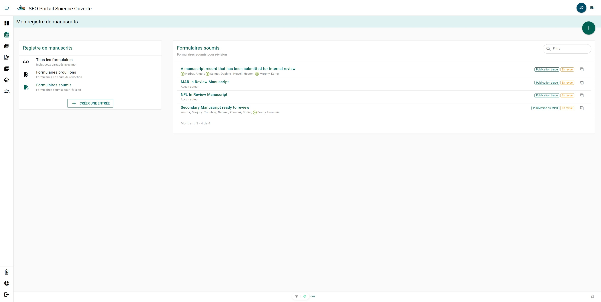

## Créer un nouveau formulaire de dossier de manuscrit {/* #create-a-new-manuscript-record-form */}

Créez un nouveau MRF à partir de la page **Mes manuscrits**.

**Étapes**

1. Cliquez sur **+ Créer un manuscrit** dans le menu **Manuscrits**.
2. Sélectionnez le **type de publication souhaité**.
3. Cliquez sur **Continuer**.
4. Entrez le titre du manuscrit dans le champ **Titre**.
5. Sélectionnez la **région responsable** dans le champ **Régions du MPO**.
6. Cliquez sur **Continuer**.
7. Cliquez sur **Créer**.

**Résultat**

Un nouveau formulaire de dossier de manuscrit est créé et ouvert pour modification.

### Informations supplémentaires {/* #additional-information */}

- Cliquez sur **Retour** pour modifier les informations saisies dans les étapes précédentes.
- Cliquez sur **Annuler** pour quitter le processus de création du manuscrit sans enregistrer.

## Naviguer dans le formulaire de dossier de manuscrit {/* #navigate-the-manuscript-record-form */}

Le formulaire de dossier de manuscrit est organisé en sections qui vous permettent de saisir les détails du manuscrit.

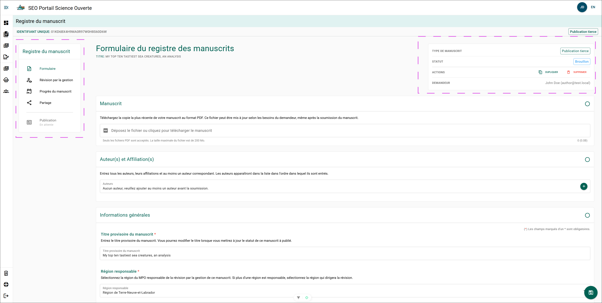

### Informations supplémentaires {/* #additional-information-1 */}

- **Menu des sections** – Utilisez la barre latérale gauche pour ouvrir des sections telles que **Informations générales**, **Auteurs**, **Évaluateurs par les pairs** et **Sources de financement**.
- **Indicateurs de progression** – Les sections contenant des champs obligatoires incomplets sont mises en évidence.
- **Champs obligatoires** – Les champs marqués d’un astérisque (*) doivent être remplis avant de soumettre le formulaire.
- **Options d’enregistrement** – Enregistrez votre progression à l’aide du bouton **Disquette** ou du bouton **Enregistrer**.
- **Statut du formulaire** – Le coin supérieur droit affiche le statut du manuscrit (par exemple, **Brouillon** ou **En révision**).

## Comprendre le menu des sections {/* #understand-the-section-menu */}

Le **menu des sections** donne accès aux pages liées au formulaire de dossier de manuscrit (MRF) et à son processus d’examen.

### Informations supplémentaires {/* #additional-information-2 */}

- **Formulaire** – Ouvre la page principale du MRF où vous remplissez et soumettez le formulaire de dossier de manuscrit.
- **Examen de gestion du manuscrit** – Ouvre la page [Examen de gestion du manuscrit](manuscript-management-review.mdx) et affiche le statut actuel de l’examen.
- **Progression du manuscrit** – Ouvre la page [Progression du manuscrit](#view-manuscript-progress) et affiche le flux de travail ainsi que l’état actuel du MRF.
- **Partage** – Ouvre la page [Partage](#share-a-manuscript-record-form) où vous pouvez partager le MRF avec d’autres utilisateurs. Les auteurs et les utilisateurs impliqués dans l’examen de gestion ont automatiquement accès au MRF et n’ont pas besoin d’être ajoutés manuellement.
- **Publication** – Ouvre le dossier de [Publication](./publications.mdx) associé, s’il existe. Un dossier de publication est créé lorsque le manuscrit est marqué comme accepté pour publication.

## Remplir le formulaire de dossier de manuscrit {/* #complete-the-manuscript-record-form */}

Après la création d’un MRF, le système attribue un identifiant unique et définit le statut à **Brouillon**. Vous devez remplir tous les champs obligatoires avant de soumettre le manuscrit pour examen de gestion.

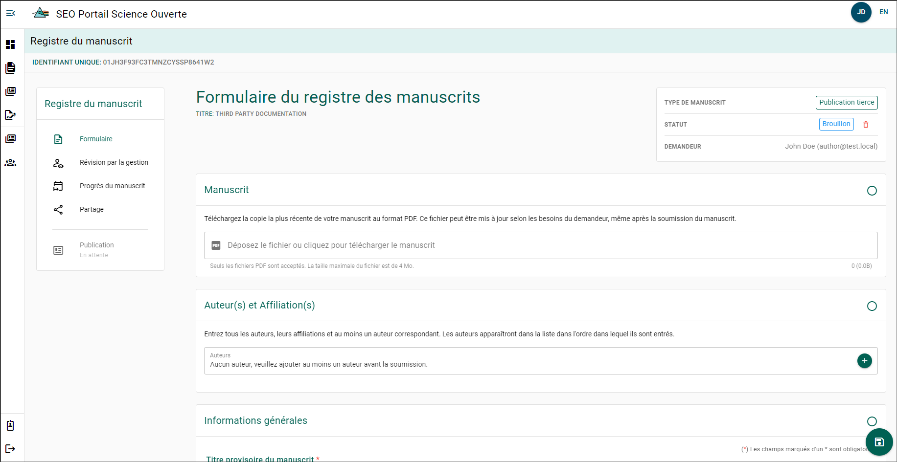

### Informations supplémentaires {/* #additional-information-3 */}

- Les champs marqués d’un astérisque (*) sont obligatoires.
- Enregistrez fréquemment votre progression afin d’éviter toute perte de données.

Vous pouvez enregistrer votre progression de deux façons :

- En cliquant sur le bouton circulaire **Disquette** situé dans le coin inférieur droit de la page.
- En faisant défiler le formulaire jusqu’au bas de la page et en cliquant sur **Enregistrer**.

Après l’enregistrement, vous pouvez quitter le PSO en toute sécurité.

## Téléverser un manuscrit {/* #upload-a-manuscript */}

Téléversez une version PDF de votre manuscrit dans le MRF. Vous pouvez téléverser une version plus récente ultérieurement si le manuscrit est modifié.

**Étapes**

1. Cliquez sur le champ **Déposez le fichier ou cliquez pour téléverser un manuscrit**.
2. Sélectionnez le PDF du manuscrit dans l’explorateur de fichiers.
3. Cliquez sur **Ouvrir**.

**Résultat**

Le PDF du manuscrit est téléversé et joint au formulaire de dossier de manuscrit.

## Ajouter des auteurs et des affiliations {/* #add-authors-and-affiliations */}

Ajoutez tous les auteurs ayant contribué au manuscrit et précisez leurs affiliations.

:::tip
**Affiliation par défaut**

Le **MPO** est sélectionné comme affiliation par défaut afin d’accélérer la saisie des données. Modifiez l’affiliation lorsque vous ajoutez des auteurs provenant d’autres organisations.
:::

**Étapes**

Répétez ces étapes pour chaque auteur :

1. Cliquez sur **+**.
2. Recherchez l’auteur dans le champ **Auteur** à l’aide de son nom ou de son adresse courriel.
3. Sélectionnez **Oui** pour **Auteur correspondant** si l’auteur sera la personne-ressource principale au sein du MPO.
4. Sélectionnez **Oui** pour **Auteur collectif** si l’auteur représente un groupe.

Si **Auteur collectif** est sélectionné :

- Recherchez le groupe par son nom.
- Sélectionnez le groupe dans les résultats de recherche.

5. Cliquez sur **Enregistrer**.

**Résultat**

L’auteur sélectionné est ajouté au formulaire de dossier de manuscrit. Les auteurs ajoutés peuvent consulter et modifier le MRF, mais ne peuvent pas le supprimer.

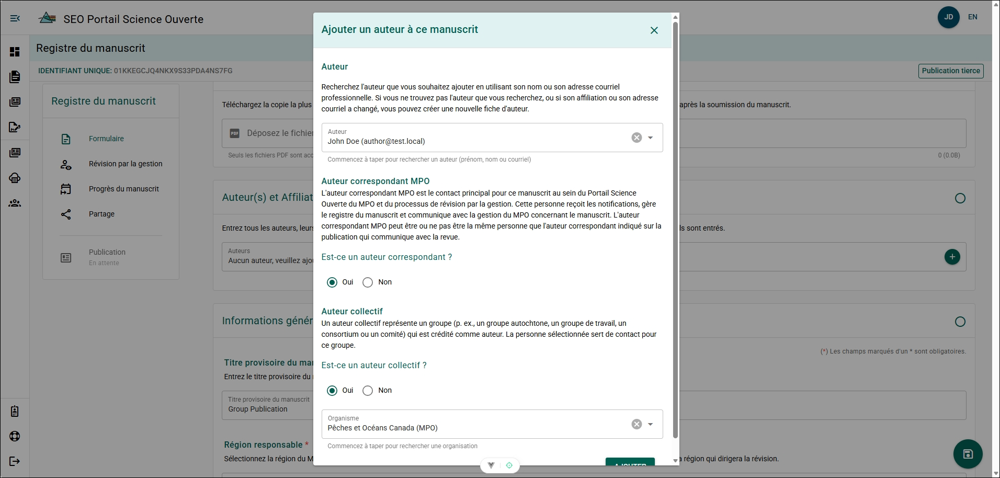

---

## Retirer un auteur ou une affiliation {/* #remove-an-author-or-affiliation */}

Retirez un auteur s’il ne doit plus être associé au manuscrit.

**Étapes**

1. Cliquez sur l’icône **X** à côté du nom de l’auteur.
2. Cliquez sur **OK**.

**Résultat**

L’auteur est retiré du formulaire de dossier de manuscrit et ne peut plus le consulter ni le modifier.

---
## Modifier l’auteur correspondant du MPO {/* #change-the-dfo-corresponding-author */}

Définissez ou modifiez l’auteur correspondant du MPO pour le manuscrit.

:::important
L’**auteur correspondant du MPO** est la personne responsable de répondre aux questions concernant le manuscrit au sein du MPO. Cette personne peut être différente de l’auteur correspondant indiqué dans l’article publié.
:::

**Étapes**

1. Cliquez sur le nom de l’auteur.
2. Activez ou désactivez le curseur **Auteur correspondant du MPO**.

**Résultat**

Le statut **Auteur correspondant du MPO** de l’auteur est mis à jour.

### Si un auteur n’apparaît pas dans la liste des auteurs {/* #if-an-author-does-not-appear-in-the-author-list */}

Si l’auteur que vous recherchez n’apparaît pas dans la liste, créez un nouveau dossier d’auteur.

Consultez [Créer un nouvel auteur](../support-and-resources/more-features.mdx#create-a-new-author).

### Si un auteur collectif n’apparaît pas dans la liste des organisations {/* #if-a-group-author-does-not-appear-in-the-organization-list */}

Si l’organisation ou l’auteur collectif n’apparaît pas dans la liste, créez un nouveau dossier d’organisation.

Consultez [Créer une nouvelle organisation](../support-and-resources/more-features.mdx#create-a-new-organization).

:::info
Le PSO enregistre les **auteurs collectifs** afin d’identifier les organisations et groupes de travail ayant contribué au processus de publication. La **liste des auteurs** sert à attribuer le crédit pour le manuscrit.
:::

---
## Ajouter des évaluateurs par les pairs {/* #add-peer-reviewers */}

Ajoutez les scientifiques qui ont effectué l’évaluation par les pairs du manuscrit.

:::tip
Cette section est **obligatoire pour les publications du MPO** et **facultative pour les rapports de données et les rapports d’entrepreneurs**.
:::

**Étapes**

Répétez ces étapes pour chaque évaluateur par les pairs :

1. Cliquez sur **+**.
2. Recherchez l’évaluateur par son nom ou son adresse courriel.
3. Sélectionnez l’évaluateur dans les résultats de recherche.
4. Cliquez sur **Enregistrer**.

**Résultat**

L’évaluateur sélectionné est ajouté au formulaire de dossier de manuscrit.

### Informations supplémentaires {/* #additional-information-4 */}

Au moins **deux experts du domaine** doivent effectuer une évaluation par les pairs du rapport.

---

## Mettre à jour le titre de travail du manuscrit {/* #update-the-manuscript-working-title */}

Le titre de travail est automatiquement rempli à partir du titre saisi lors de la création du manuscrit.

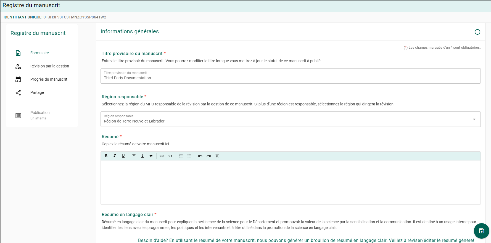

**Étapes**

1. Cliquez sur le champ **Titre**.
2. Entrez le titre mis à jour du manuscrit.
3. Enregistrez les modifications.

**Résultat**

Le titre mis à jour est enregistré dans le formulaire de dossier de manuscrit.

### Informations supplémentaires {/* #additional-information-5 */}

Vous pouvez enregistrer les modifications de deux façons :

- En cliquant sur l’icône **Disquette** située dans le coin inférieur droit de la page.
- En faisant défiler la page jusqu’en bas et en cliquant sur **Enregistrer**.
## Mettre à jour la région responsable {/* #update-the-lead-region */}

La **région responsable** est automatiquement remplie à partir de la région sélectionnée lors de la création du manuscrit.

**Étapes**

1. Cliquez sur le champ **Région responsable**.
2. Sélectionnez la région appropriée.
3. Enregistrez les modifications.

**Résultat**

La **région responsable** mise à jour est enregistrée dans le formulaire de dossier de manuscrit.

### Informations supplémentaires {/* #additional-information-6 */}

Vous pouvez enregistrer les modifications de deux façons :

- En cliquant sur l’icône **Disquette** située dans le coin inférieur droit de la page.
- En faisant défiler la page jusqu’en bas et en cliquant sur **Enregistrer**.

---

## Ajouter le résumé {/* #add-the-abstract */}

Ajoutez le résumé du manuscrit au dossier.

**Étapes**

1. Copiez le résumé à partir de votre manuscrit.
2. Collez le résumé dans le champ de texte **Résumé**.
3. Enregistrez les modifications.

**Résultat**

Le résumé est enregistré dans le formulaire de dossier de manuscrit.

---

## Ajouter un résumé en langage clair {/* #add-a-plain-language-summary */}

Fournissez un résumé en langage clair (RLC) afin d’améliorer l’accessibilité de la publication.

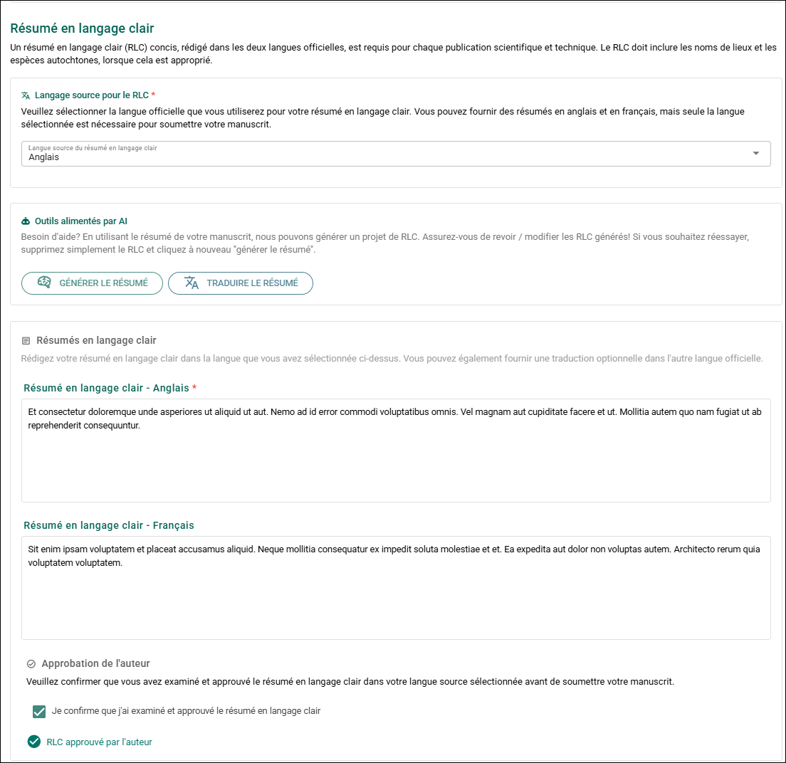

### Informations supplémentaires {/* #additional-information-7 */}

- Les résumés en langage clair sont obligatoires pour toutes les publications scientifiques.
- Le résumé doit être rédigé à un niveau de lecture correspondant approximativement à la **8e année** afin de favoriser une meilleure compréhension.
- Des conseils sur la rédaction en langage clair sont disponibles auprès du gouvernement du Canada :  
  [Bureau de la communauté des communications](https://www.canada.ca/fr/gouvernement/systeme/communications-gouvernementales/bureau-collectivite-communications.html)

### Sélectionner la langue source du RLC {/* #select-the-source-language-of-the-pls */}

Choisissez la langue utilisée pour le résumé en langage clair requis.

**Étapes**

1. Sélectionnez **Anglais** ou **Français** dans le champ **Langue source du RLC**.

**Résultat**

La langue sélectionnée devient la langue obligatoire du résumé en langage clair lors de l’examen de gestion.
### Informations supplémentaires {/* #additional-information-8 */}

Vous pouvez fournir le résumé en **anglais et en français**, mais seule la langue source sélectionnée est requise pour la soumission.

### Générer une ébauche de résumé en langage clair {/* #generate-a-plain-language-summary-draft */}

Générez une ébauche de résumé en langage clair (RLC) à l’aide du résumé du manuscrit et de la langue sélectionnée.

:::note
L’outil **Générer un RLC** utilise le modèle de langage d’intelligence artificielle (IA) [Llama 3.2](https://www.llama.com/), développé par Meta.

Cet outil fonctionne entièrement à l’intérieur du réseau du MPO. Les informations soumises à l’outil **ne quittent pas l’intranet du MPO** et **ne peuvent pas être transmises à Meta ou à des systèmes externes**.

Lors de l’utilisation d’outils d’IA dans le réseau du gouvernement du Canada, consultez les directives du Secrétariat du Conseil du Trésor du Canada concernant l’utilisation responsable de l’IA :  
[Guide sur l’utilisation de l’intelligence artificielle générative](https://www.canada.ca/fr/gouvernement/systeme/gouvernement-numerique/innovations-gouvernementales-numeriques/utilisation-responsable-ai/guide-utilisation-intelligence-artificielle-generative.html)
:::

:::tip
La fonctionnalité **Générer un RLC** crée une ébauche à partir du résumé de votre manuscrit. Vous pouvez générer plusieurs versions afin d’améliorer le résumé.

Après avoir finalisé le RLC, vous pouvez utiliser **Traduire le RLC** pour générer une version dans l’autre langue officielle.
:::

**Étapes**

1. Cliquez sur **Générer un RLC**.
2. Examinez l’ébauche générée.
3. Modifiez le résumé au besoin.

**Résultat**

Une ébauche du résumé en langage clair apparaît dans le champ de texte du RLC.

### Informations supplémentaires {/* #additional-information-9 */}

Enregistrez vos modifications après avoir ajouté ou modifié le résumé :

- En cliquant sur l’icône **Disquette** située dans le coin inférieur droit de la page.
- En faisant défiler la page jusqu’en bas et en cliquant sur **Enregistrer**.

---

## Confirmer l’approbation de l’auteur du résumé en langage clair {/* #confirm-author-approval-of-the-plain-language-summary */}

Confirmez que l’auteur a examiné et approuvé le résumé en langage clair.

**Étapes**

1. Examinez le résumé en langage clair complété.
2. Sélectionnez la confirmation **Approbation de l’auteur**.

**Résultat**

Le système enregistre que l’auteur a examiné et approuvé le résumé en langage clair.

:::important
Si vous remplissez le formulaire au nom de l’auteur, assurez-vous que celui-ci a examiné le résumé en langage clair avant de confirmer l’approbation. Les auteurs peuvent accéder à leur propre MRF en se connectant au portail.
:::

---

## Sélectionner un domaine fonctionnel {/* #select-a-functional-area */}

Appliquez une étiquette de **domaine fonctionnel** afin de classifier le domaine de recherche du manuscrit.

**Étapes**

1. Cliquez sur le champ **Domaine fonctionnel**.
2. Sélectionnez le **domaine fonctionnel** approprié dans la liste.

**Résultat**

Le domaine fonctionnel sélectionné est appliqué au formulaire de dossier de manuscrit.

### Informations supplémentaires {/* #additional-information-10 */}

Les étiquettes de domaine fonctionnel aident à améliorer les rapports et le suivi des domaines de recherche scientifique du MPO.

## Ajouter le résumé de pertinence {/* #add-the-relevance-summary */}

Fournissez un résumé décrivant comment le manuscrit soutient le programme qui l’a financé et comment il s’aligne sur le mandat du ministère, son plan stratégique ou les priorités régionales.

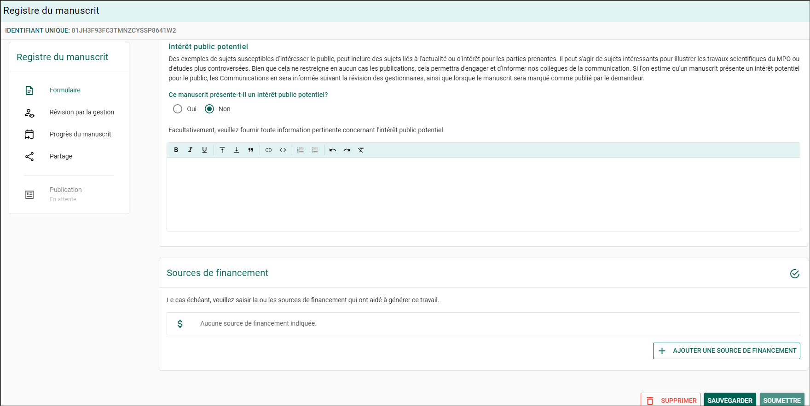

**Étapes**

1. Entrez le résumé dans le champ **Pertinence pour les programmes/initiatives/secteur client**.
2. Enregistrez les modifications.

**Résultat**

Le résumé de pertinence est enregistré dans le formulaire de dossier de manuscrit.
### Informations supplémentaires {/* #additional-information-11 */}

Vous pouvez enregistrer les modifications de deux façons :

- En cliquant sur l’icône **Disquette** située dans le coin inférieur droit de la page.
- En faisant défiler la page jusqu’en bas et en cliquant sur **Enregistrer**.

---

## Indiquer un intérêt public potentiel {/* #indicate-potential-public-interest */}

Indiquez si le manuscrit pourrait susciter un intérêt public.

**Étapes**

1. Sélectionnez **Oui** ou **Non** dans le champ **Intérêt public potentiel**.

**Étapes conditionnelles**

Si **Oui** est sélectionné :

- Entrez les détails concernant l’intérêt public potentiel dans le champ de texte.

**Résultat**

Le dossier du manuscrit indique si la publication pourrait susciter un intérêt public.

---

## Définir la licence du rapport {/* #set-report-licensing */}

Indiquez si le rapport doit être publié sous la **Licence du gouvernement ouvert – Canada**.

:::tip
Cette section est visible uniquement pour les **publications du MPO**.
:::

**Étapes**

1. Sélectionnez **Oui** ou **Non** dans le champ **Licence du rapport**.

**Étapes conditionnelles**

Si **Non** est sélectionné :

- Entrez une explication décrivant pourquoi la **Licence du gouvernement ouvert – Canada** ne peut pas être appliquée.

**Résultat**

Le statut de licence sélectionné est enregistré dans le formulaire de dossier de manuscrit.

### Informations supplémentaires {/* #additional-information-12 */}

Le MPO suit le principe de la science ouverte **Ouvert par conception et par défaut**. Les publications devraient être publiées sous la version la plus récente de la **Licence du gouvernement ouvert – Canada** lorsque cela est possible.

La licence ne doit pas être appliquée lorsqu’il existe des obligations de licence conflictuelles.

---

## Indiquer une publication en libre accès {/* #indicate-open-publication */}

Indiquez si la publication sera rendue librement accessible.

**Étapes**

1. Sélectionnez **Oui** ou **Non** dans le champ **Publication en libre accès**.

**Étapes conditionnelles**

Si **Non** est sélectionné :

- Entrez la justification expliquant pourquoi le libre accès ne peut pas être appliqué.

**Résultat**

Le dossier du manuscrit indique si la publication sera accessible librement.

### Informations supplémentaires {/* #additional-information-13 */}

L’approche **Ouvert par conception et par défaut** exige que les publications soient librement et publiquement accessibles, sauf si une exception s’applique.

Les exceptions peuvent inclure des situations où les informations, les données ou le code sont restreints en raison :

- de la sécurité de la recherche
- d’intérêts exclusifs
- de restrictions imposées par des tiers
- d’ententes juridiques, éthiques ou de confidentialité

## Ajouter des sources de financement {/* #add-funding-sources */}

Ajoutez des sources de financement si les travaux ayant contribué au manuscrit ont été soutenus par un programme.

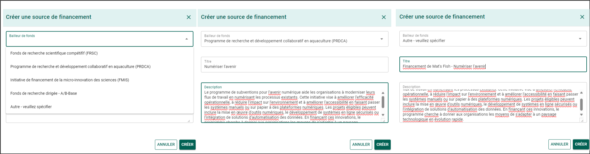

**Étapes**

1. Cliquez sur **+ AJOUTER UNE SOURCE DE FINANCEMENT**.
2. Cliquez sur le champ **Bailleur de fonds**.
3. Sélectionnez le bailleur de fonds approprié dans la liste.
4. Entrez le nom du programme dans le champ **Titre**.
5. Entrez une description du programme de financement et de ses exigences dans le champ **Description**.
6. Cliquez sur **Créer**.

Répétez ces étapes pour ajouter des sources de financement supplémentaires.

**Résultat**

La source de financement est ajoutée au formulaire de dossier de manuscrit.
### Informations supplémentaires {/* #additional-information-14 */}

Après avoir ajouté des sources de financement, enregistrez vos modifications :

- En cliquant sur l’icône **Disquette** située dans le coin inférieur droit de la page.
- En faisant défiler la page jusqu’en bas et en cliquant sur **Enregistrer**.

---

## Modifier une source de financement {/* #edit-a-funding-source */}

Mettez à jour les informations d’une source de financement existante.

**Étapes**

1. Cliquez sur l’icône **Crayon** à côté de la source de financement.
2. Mettez à jour les champs requis.
3. Cliquez sur **Enregistrer**.

**Résultat**

Les informations mises à jour de la source de financement sont enregistrées.

---

## Supprimer une source de financement {/* #delete-a-funding-source */}

Retirez une source de financement du formulaire de dossier de manuscrit.

**Étapes**

1. Cliquez sur l’icône **Corbeille** à côté de la source de financement.
2. Cliquez sur **OK** pour confirmer.

**Résultat**

La source de financement est retirée du formulaire de dossier de manuscrit.

## Soumettre le manuscrit pour examen de gestion {/* #submit-the-manuscript-for-management-review */}

Soumettez le formulaire de dossier de manuscrit (MRF) une fois que tous les champs obligatoires sont remplis.

:::important
Le **demandeur du MRF ou tout auteur inscrit** peut soumettre le manuscrit pour examen de gestion.

L’utilisateur qui soumet le MRF devient automatiquement le **demandeur du MRF**.

Si la personne ayant créé le MRF **n’est pas un auteur** (par exemple, un adjoint administratif), elle pourrait perdre l’accès au MRF après la soumission. Un auteur peut lui repartager le MRF au besoin.
:::

**Étapes**

1. Faites défiler jusqu’au bas de la page **Dossier de manuscrit**.
2. Cliquez sur **Soumettre**.
3. Examinez l’énoncé de consentement **Soumission pour examen de gestion**.
4. Cliquez sur **Oui** pour accepter le consentement.
5. Cliquez sur **Suivant**.
6. Entrez le nom du **gestionnaire de division** dans le champ de recherche.
7. Sélectionnez le gestionnaire dans les résultats de recherche.
8. Cliquez sur **Soumettre**.

**Étapes conditionnelles**

Si le **gestionnaire de division** n’apparaît pas dans les résultats de recherche :

1. Cliquez sur **Vous ne trouvez pas l’utilisateur recherché ?**.
2. Entrez le **prénom**, le **nom de famille**, l’**adresse courriel** et la **langue préférée** du gestionnaire.
3. Cliquez sur **Inviter**.

**Résultat**

Le manuscrit est soumis pour examen de gestion.

Pour confirmer la soumission, vérifiez la boîte **Statut** située dans le coin supérieur droit de la page **Dossier de manuscrit**. Le statut devrait afficher **En révision**.

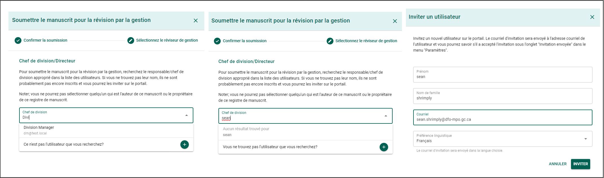

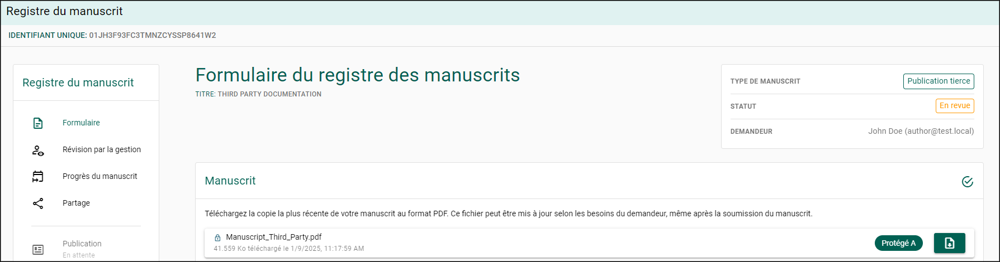

---
## Soumettre le manuscrit pour publication {/* #submit-the-manuscript-for-publication */}

Après avoir terminé le **processus d’examen de gestion du manuscrit**, vous pouvez soumettre le manuscrit par l’entremise du **Guichet unique des publications scientifiques**.

### Publication scientifique et technique secondaire du SEO {/* #eos-secondary-scientific-and-technical-publication */}

:::warning
**Informations requises**

Vous devez obtenir un **numéro de catalogue** avant de soumettre le manuscrit au Guichet unique.

Pour demander un numéro de catalogue :

1. Remplissez le **Formulaire de demande de numéros de publication**.  
   [FORMULAIRE DE DEMANDE DE NUMÉROS DE PUBLICATION](https://intranet.ent.dfo-mpo.ca/mpo/sites/dfo-mpo/files/publishing-form-formulaire-publication-fra.pdf)
2. Envoyez le formulaire rempli à [**Publications.XNCR@dfo-mpo.gc.ca**](mailto:Publications.XNCR@dfo-mpo.gc.ca).
:::

## Soumettre le manuscrit au Guichet unique {/* #submit-the-manuscript-to-the-single-window */}

Soumettez le manuscrit au **Guichet unique des publications scientifiques** après avoir terminé le processus d’examen de gestion du manuscrit.

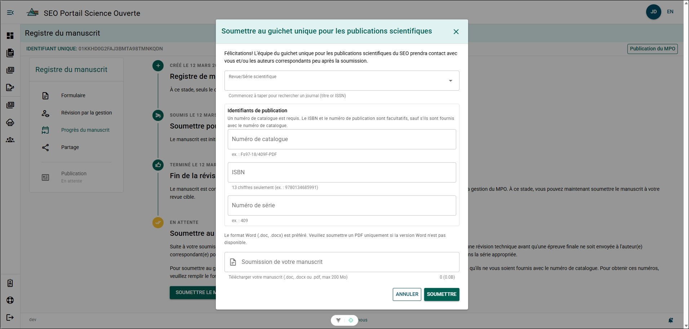

**Étapes**

1. Ouvrez le formulaire de dossier de manuscrit.
2. Sélectionnez **Progression du manuscrit** dans le menu des sections.
3. Cliquez sur **Soumettre le manuscrit**.
4. Remplissez le formulaire.

Remplissez le formulaire :

- **Revue/Série** – Sélectionnez la série de publication.
- **Numéro de catalogue** – Entrez le numéro de catalogue attribué.
- **Copie du manuscrit** – Téléversez le fichier du manuscrit (.docx ou .doc accepté).
- **ISBN** – Entrez l’ISBN s’il est disponible.
- **Numéro de publication** – Entrez le numéro de publication, s’il y a lieu.

5. Cliquez sur **Soumettre**.

**Résultat**

Le manuscrit est soumis au **Guichet unique des publications scientifiques** pour examen et publication. Vous recevrez une notification lorsque le manuscrit sera publié ou si des modifications sont requises.

:::info
Vous pouvez tout de même téléverser votre manuscrit en format PDF. Toutefois, le Guichet unique ne pourra pas effectuer de modifications au besoin. Si des modifications sont requises, l’équipe du Guichet unique communiquera avec vous par courriel.
:::

---

## Soumettre à une revue tierce {/* #submit-to-a-third-party-journal */}

Soumettez le manuscrit à une revue après avoir terminé le processus d’examen de gestion du manuscrit.

Continuez à mettre à jour le formulaire de dossier de manuscrit tout au long du processus de publication afin d’améliorer les indicateurs de temps de publication et d’accroître la visibilité des travaux.

### Enregistrer la soumission initiale à une revue {/* #record-the-initial-submission-to-a-journal */}

**Étapes**

1. Ouvrez le formulaire de dossier de manuscrit.
2. Sélectionnez **Progression du manuscrit** dans le menu des sections.
3. Cliquez sur **Marquer comme soumis** sous **Soumission initiale pour publication**.
4. Entrez la date de soumission dans le champ **Soumis à la revue le**.

Vous pouvez :

- saisir la date au format **AAAA-MM-JJ**, ou
- sélectionner la date à l’aide de l’icône **Calendrier**.

5. Cliquez sur **Mettre à jour**.

**Résultat**

Le formulaire de dossier de manuscrit enregistre la date à laquelle le manuscrit a été soumis à la revue.

## Enregistrer l’acceptation du manuscrit {/* #record-manuscript-acceptance */}

Enregistrez le moment où le manuscrit a été accepté pour publication.

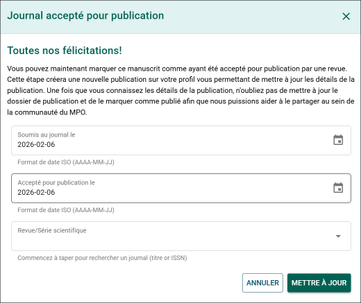

**Étapes**

1. Ouvrez le formulaire de dossier de manuscrit.
2. Sélectionnez **Progression du manuscrit** dans le menu des sections.
3. Cliquez sur **Marquer comme accepté**.
4. Remplissez le formulaire.

Remplissez le formulaire :

- **Soumis à la revue le** – Mettez à jour la date de soumission au besoin.
- **Accepté pour publication le** – Entrez la date d’acceptation.
- **Revue/Série** – Sélectionnez la revue ou la série de publication.

5. Cliquez sur **Mettre à jour**.

**Étapes conditionnelles**

Si la revue n’est pas répertoriée :

- Envoyez un courriel à l’**équipe de soutien du PSO** afin de demander l’ajout de la revue :  
  DFO.OpenScience-ScienceOuverte.MPO@dfo-mpo.gc.ca

**Résultat**

Le formulaire de dossier de manuscrit est mis à jour pour indiquer que le manuscrit a été accepté pour publication.

---
## Retirer un manuscrit {/* #withdraw-a-manuscript */}

Retirez le manuscrit s’il ne doit plus poursuivre le processus de publication.

**Étapes**

1. Ouvrez le formulaire de dossier de manuscrit.
2. Sélectionnez **Progression du manuscrit** dans le menu des sections.
3. Cliquez sur **Retirer le manuscrit**.
4. Cliquez sur **Retirer** pour confirmer.

**Résultat**

Le manuscrit est marqué comme retiré dans le formulaire de dossier de manuscrit.

---

## Consulter la progression du manuscrit {/* #view-manuscript-progress */}

Utilisez la page **Progression du manuscrit** pour suivre l’état du manuscrit tout au long du processus de publication.

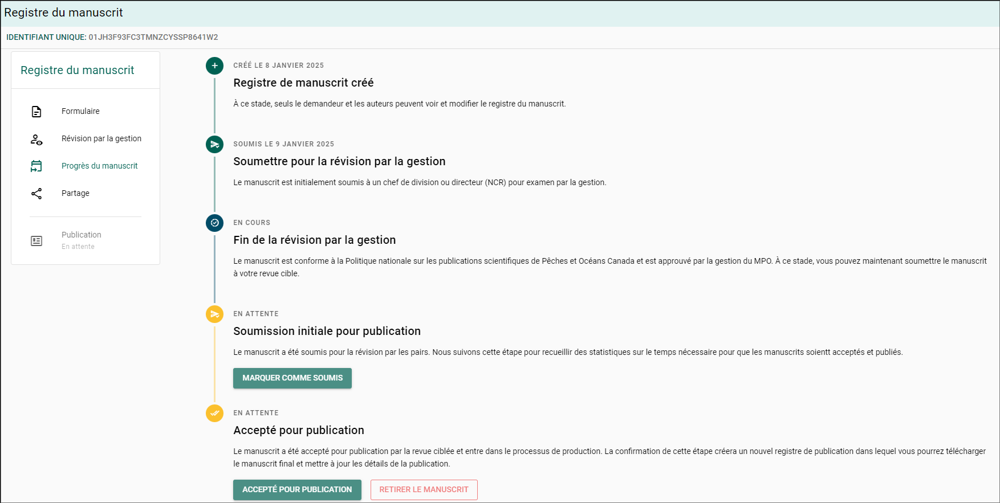

**Étapes**

1. Ouvrez le manuscrit à partir de la page **Mes dossiers de manuscrits**.
2. Cliquez sur **Progression du manuscrit** dans le menu du dossier de manuscrit.

**Résultat**

La page **Progression du manuscrit** affiche le statut actuel du flux de travail et les étapes importantes de publication du manuscrit.

---

## Courriels de rappel mensuels {/* #monthly-reminder-emails */}

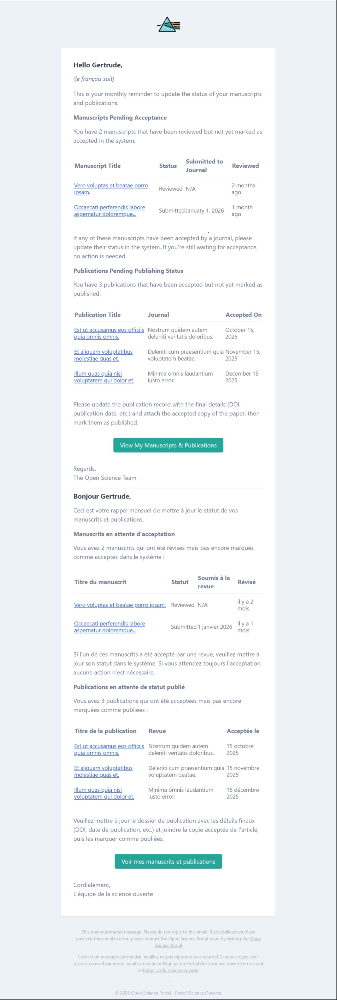

### Informations supplémentaires {/* #additional-information-15 */}

Le PSO envoie un **courriel de rappel mensuel** si vous avez des formulaires de dossier de manuscrit dont l’étape **Examen de gestion** est marquée comme **Terminée**.

Ces rappels aident à assurer un suivi précis du cycle de vie des publications et à maintenir les informations des manuscrits à jour dans le PSO.

## Accéder aux manuscrits régionaux {/* #access-regional-manuscripts */}

Les utilisateurs ayant le rôle **Éditeur régional** peuvent consulter et modifier les formulaires de dossier de manuscrit (MRF) lorsque leur région est la **région responsable**.

- Lorsque le statut du MRF est **Brouillon** ou **En révision**, les éditeurs régionaux peuvent modifier et enregistrer les changements.
- Lorsque le statut du MRF est **Révisé**, les éditeurs régionaux peuvent seulement consulter le MRF.

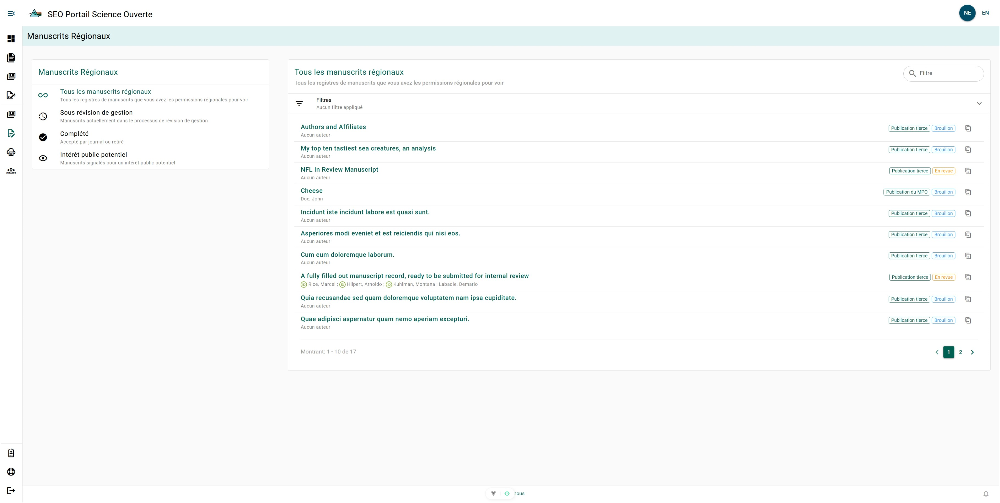

**Étapes**

1. Survolez le côté gauche de l’écran pour développer le menu de navigation.
2. Cliquez sur **Manuscrits régionaux**.
3. Repérez le manuscrit.

**Étapes facultatives**

Pour filtrer les résultats :

- Entrez un titre de manuscrit ou un nom d’auteur dans le champ **Filtrer**.
- Sélectionnez un état de manuscrit dans le panneau **Manuscrits régionaux**.

4. Cliquez sur le titre du manuscrit pour ouvrir le dossier.

**Résultat**

Le formulaire de dossier de manuscrit sélectionné s’ouvre.

---
## Partager un formulaire de dossier de manuscrit {/* #share-a-manuscript-record-form */}

Partagez l’accès à un formulaire de dossier de manuscrit (MRF) avec un autre utilisateur, comme un administrateur ou un chef de section.

:::tip
Les auteurs et réviseurs du MPO associés au MRF ont déjà accès au dossier selon leur rôle et n’ont pas besoin d’être ajoutés manuellement.
:::

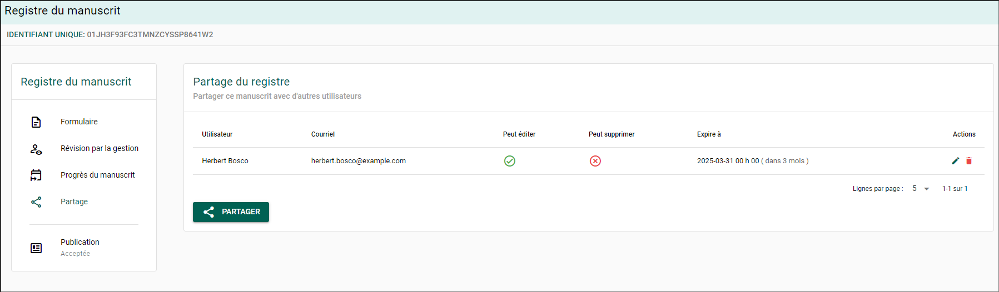

**Étapes**

1. Ouvrez le manuscrit à partir de la page **Mes dossiers de manuscrits**.
2. Sélectionnez **Partage** dans le menu des sections.
3. Cliquez sur **Partager**.
4. Entrez le nom ou l’adresse courriel de l’utilisateur dans le champ de recherche **Utilisateur**.
5. Sélectionnez l’utilisateur dans les résultats de recherche.
6. Sélectionnez le niveau d’accès.

Choisissez l’une des options suivantes :

- **Peut modifier** – Permet à l’utilisateur de consulter et modifier le MRF.
- **Peut supprimer** – Permet à l’utilisateur de supprimer le MRF.

7. (Facultatif) Définissez une date d’expiration dans le champ **Expire le**.
8. Cliquez sur **Partager**.

**Étapes conditionnelles**

Si l’utilisateur n’apparaît pas dans les résultats de recherche :

- Suivez les étapes dans **[Inviter un utilisateur](../support-and-resources/more-features#invite-a-user)**.

**Résultat**

L’utilisateur sélectionné reçoit l’accès au formulaire de dossier de manuscrit avec les permissions attribuées.

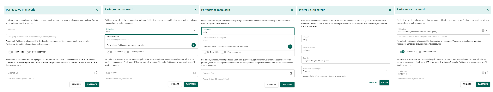

## Modifier les permissions de partage {/* #edit-share-permissions */}

Mettez à jour les permissions d’un formulaire de dossier de manuscrit partagé existant.

**Étapes**

1. Cliquez sur l’icône **Crayon** dans la colonne **Actions**.
2. Mettez à jour les paramètres de partage.
3. Cliquez sur **Enregistrer**.

**Résultat**

Les permissions mises à jour sont appliquées au formulaire de dossier de manuscrit partagé.

---

## Retirer les permissions de partage {/* #remove-share-permissions */}

Retirez l’accès partagé d’un utilisateur au formulaire de dossier de manuscrit.

**Étapes**

1. Cliquez sur l’icône **Corbeille** dans la colonne **Actions**.
2. Cliquez sur **OK** pour confirmer.

**Résultat**

L’accès de l’utilisateur au formulaire de dossier de manuscrit est retiré.