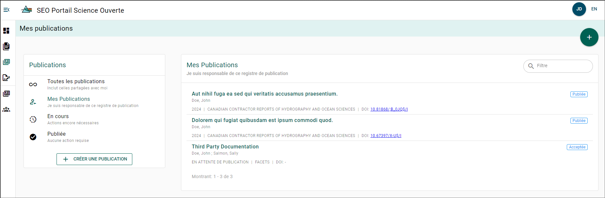
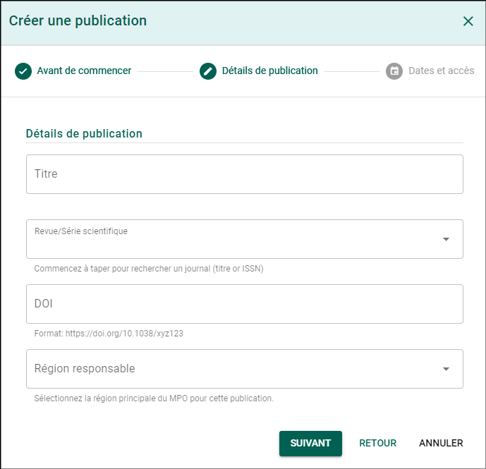
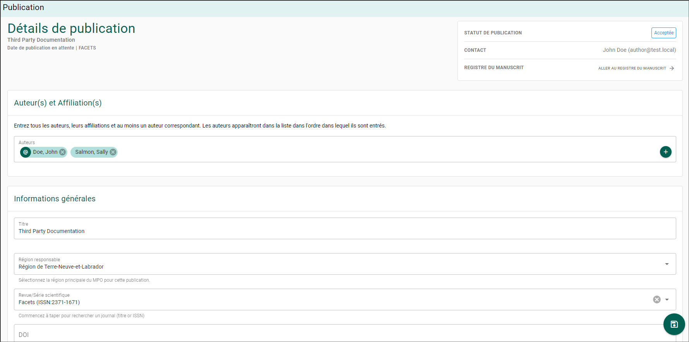
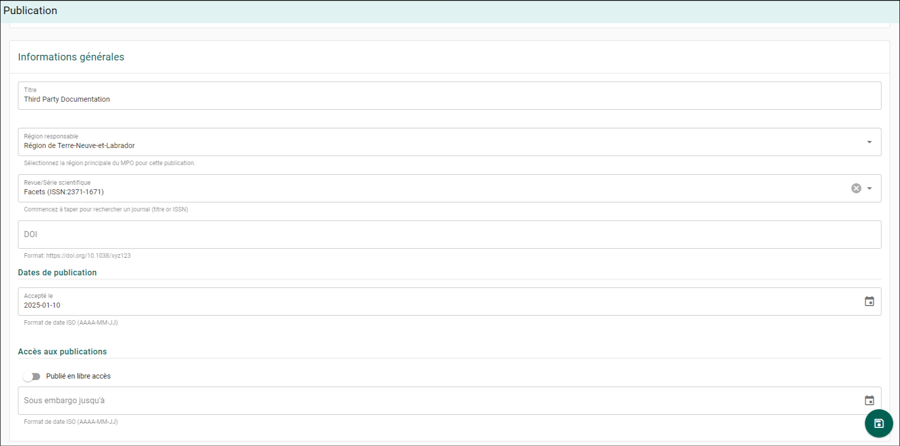
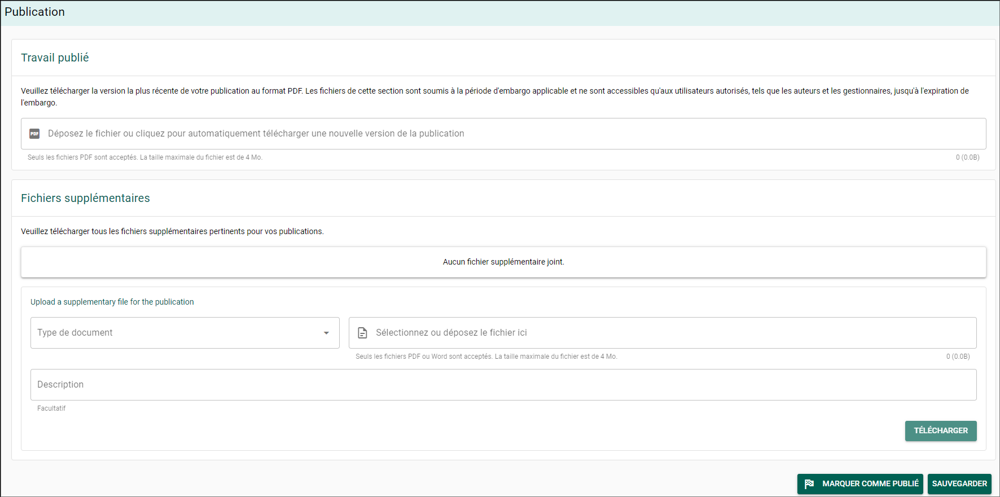
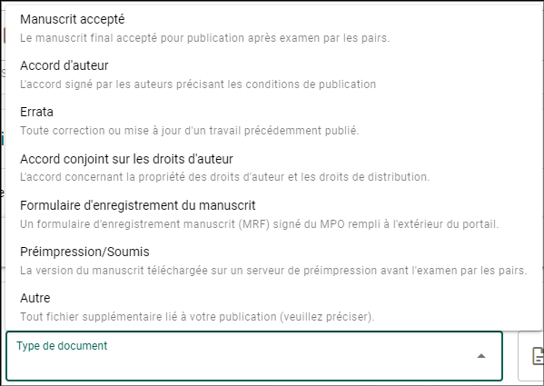
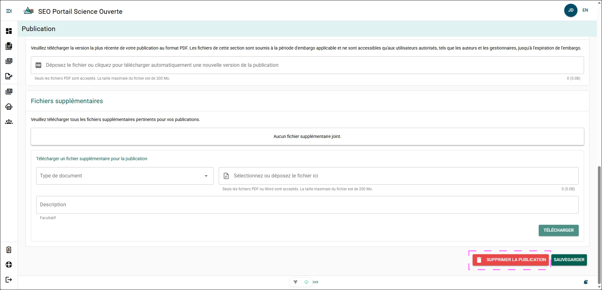

# Publications

## Page Mes publications {/* #my-publications-page */}

La page **Mes publications** vous permet de consulter tous les dossiers de publication que vous avez créés ou qui ont été partagés avec vous. À partir de cette page, vous pouvez créer de nouveaux dossiers de publication ou gérer des dossiers existants.

Pour accéder à la page **Mes publications** :

1. Survolez le menu latéral gauche pour développer le menu de sélection des pages.
2. Cliquez sur **Mes publications**.

## Créer un dossier pour une publication existante {/* #creating-a-record-for-an-existing-publication */}

Vous pouvez créer un dossier de publication pour des travaux publiés à l’extérieur du PSO. La création d’un dossier de publication pour des travaux existants améliore leur visibilité au sein du MPO et aide à créer une archive numérique centralisée des documents associés à votre publication.

Pour créer un nouveau dossier de publication :

1. Survolez le menu latéral gauche pour développer le menu de sélection des pages.
2. Sélectionnez **Mes publications**.
3. Cliquez sur le bouton **CRÉER UNE PUBLICATION**.
4. Cliquez sur le bouton **SUIVANT**.
5. Remplissez le formulaire **Détails de la publication** > Cliquez sur le bouton **SUIVANT**.
   - Titre
   - Revue/Série
   - DOI (facultatif)
   - Région responsable
6. Remplissez le formulaire [**Dates de publication et accès à la publication**](#publication-dates) > Cliquez sur le bouton **CRÉER**.
   - Accepté le (facultatif)
   - Publié le
   - Publié en libre accès
   - Sous embargo jusqu’au (s’il y a lieu)

Cela créera un nouveau dossier de publication et ouvrira le formulaire **Détails de la publication**.

## Mettre à jour un dossier de publication {/* #updating-a-publication-record */}

Un dossier de publication peut évoluer après sa soumission à une revue. Il doit être mis à jour à mesure que de nouvelles métadonnées et de nouveaux documents sont créés.

Pour mettre à jour un dossier de publication :

1. Accédez à la page **Mes publications**.
2. Cliquez sur le dossier de publication que vous souhaitez mettre à jour.

### Auteur(s) et affiliation(s) {/* #authors-and-affiliations */}

#### Ajouter des auteurs et des affiliations {/* #adding-authors-and-affiliations */}

1. Cliquez sur le bouton **+**.
2. Cliquez sur le champ **Auteur**.
3. Commencez à saisir le nom de l’auteur ou de l’affilié que vous souhaitez ajouter. Si son nom existe dans la base de données, il apparaîtra. Cliquez sur son nom pour le sélectionner. Si son nom n’apparaît pas, suivez les étapes suivantes :
   1. Cliquez sur le bouton **+** pour ajouter un nouveau dossier d’auteur ou d’affilié.
   2. Ajoutez le prénom, le nom de famille, l’affiliation organisationnelle, l’adresse courriel et l’ORCID (facultatif) > Cliquez sur le bouton **Créer** pour ajouter le nouveau dossier d’auteur.
4. Indiquez si cet auteur est l’**auteur correspondant**.
5. Cliquez sur le bouton **Ajouter** pour ajouter l’auteur ou l’affilié.
6. Répétez les étapes 1 à 6 jusqu’à ce que tous les auteurs ou affiliés aient été ajoutés.

:::info
Un auteur qui ne possède pas d’adresse courriel valide et qui est crédité dans la publication n’a pas besoin d’être ajouté.
:::

#### Mettre à jour un auteur ou une affiliation {/* #updating-author-or-affiliation */}

Pour mettre à jour le statut d’**auteur correspondant** d’un auteur ou affilié ajouté :

1. Cliquez sur son nom.
2. Activez ou désactivez le curseur **Auteur correspondant** pour modifier le statut.

#### Retirer un auteur ou un affilié {/* #removing-an-author-or-affiliate */}

Pour retirer un auteur ou un affilié :

1. Cliquez sur l’icône **X** située à droite de son nom.

### Informations générales {/* #general-information */}

#### Titre {/* #title */}

Pour mettre à jour le titre :

1. Sélectionnez le champ **Titre**.
2. Mettez à jour le texte du titre.
3. Cliquez sur le bouton **ENREGISTRER** au bas de la page ou sur l’icône **Disquette**.

#### Région responsable {/* #lead-region */}

Pour mettre à jour la région responsable :

1. Sélectionnez le champ **Région responsable**.
2. Choisissez la nouvelle région responsable dans la liste déroulante.
3. Cliquez sur le bouton **ENREGISTRER** au bas de la page ou sur l’icône **Disquette**.

#### Revue/Série {/* #journalseries */}

Pour mettre à jour la revue ou la série à laquelle le manuscrit a été soumis :

1. Sélectionnez le champ **Revue/Série**.
2. Saisissez le titre ou l’ISSN de la publication.
3. Sélectionnez la nouvelle revue ou série dans la liste déroulante. Si elle n’est pas répertoriée, veuillez envoyer un courriel au [soutien du PSO](mailto:DFO.OpenScience-ScienceOuverte.MPO@dfo-mpo.gc.ca).
4. Cliquez sur le bouton **ENREGISTRER** au bas de la page ou sur l’icône **Disquette**.

#### DOI {/* #doi */}

Pour ajouter ou mettre à jour l’identifiant d’objet numérique (DOI) de votre publication :

1. Sélectionnez le champ **DOI**.
2. Entrez le DOI dans ce format : `https://doi.org/10.1038/xyz123`.
3. Cliquez sur le bouton **ENREGISTRER** au bas de la page ou sur l’icône **Disquette**.

#### Dates de publication {/* #publication-dates */}

Pour mettre à jour la date d’acceptation de votre manuscrit :

1. Sélectionnez le champ **Accepté le**.
2. Entrez la date mise à jour au format AAAA-MM-JJ, ou cliquez sur l’icône **Calendrier** pour sélectionner une date dans le calendrier.
3. Cliquez sur le bouton **ENREGISTRER** au bas de la page ou sur l’icône **Disquette**.

#### Accès à la publication {/* #publication-access */}

Si votre publication a été publiée sous une licence de science ouverte :

1. Sélectionnez le bouton bascule **Publié en libre accès**.
2. Cliquez sur le bouton **ENREGISTRER** au bas de la page ou sur l’icône **Disquette**.

Si votre publication comporte une **date d’embargo** :

1. Sélectionnez le champ **Sous embargo jusqu’au**.
2. Entrez la date mise à jour au format AAAA-MM-JJ, ou cliquez sur l’icône **Calendrier** pour sélectionner une date dans le calendrier.
3. Cliquez sur le bouton **ENREGISTRER** au bas de la page ou sur l’icône **Disquette**.

Pendant la période d’embargo, votre publication téléversée ne pourra pas être téléchargée par les autres utilisateurs du PSO. Les utilisateurs autorisés, comme les auteurs et les gestionnaires, pourront tout de même accéder à la copie téléversée durant cette période.

### Travaux publiés {/* #published-work */}

Pour téléverser la version la plus récente de votre publication :

1. Sélectionnez le champ **Déposez le fichier ou cliquez pour téléverser automatiquement une nouvelle version de la publication**.
2. Repérez la copie PDF de votre publication dans l’explorateur de fichiers > Cliquez pour la sélectionner > Cliquez sur le bouton **Ouvrir**.
3. Cliquez sur le bouton **ENREGISTRER** au bas de la page ou sur l’icône **Disquette**.

### Fichiers supplémentaires {/* #supplementary-files */}

Des fichiers supplémentaires peuvent être téléversés dans votre dossier de publication au fur et à mesure de leur création. Ces fichiers peuvent être en format PDF ou Word et devraient être téléversés afin de compléter le dossier de publication.

Pour téléverser un fichier supplémentaire :

1. Sélectionnez le champ **Type de document**.
2. Choisissez le type de document dans la liste.
3. Sélectionnez le champ **Sélectionnez ou déposez un fichier ici** > Repérez votre fichier dans l’explorateur de fichiers > Cliquez pour le sélectionner > Cliquez sur le bouton **Ouvrir**.
4. Facultativement, fournissez un contexte dans le champ **Description**.
5. Répétez les étapes 1 à 4 pour ajouter plusieurs fichiers supplémentaires.
6. Cliquez sur le bouton **ENREGISTRER** au bas de la page ou sur l’icône **Disquette**.
### Marquer comme publié ou enregistrer {/* #mark-as-published-or-save */}

Si votre travail est confirmé comme publié :

1. Cliquez sur le bouton **MARQUER COMME PUBLIÉ**.

Cela marquera votre publication comme « Publiée » et la rendra visible dans l’[Explorateur de publications](../portal-features/publication-explorer.mdx).

Si vous mettez à jour un dossier publié ou êtes en attente de confirmation de publication :

1. Cliquez sur le bouton **ENREGISTRER**.

## Supprimer un dossier de publication {/* #deleting-a-publication-record */}

Il peut arriver qu’un **dossier de publication** ait été créé mais ne soit plus nécessaire dans le PSO. Par exemple, un dossier de publication en double peut avoir été créé et un seul doit être conservé dans le PSO.

:::important

Un **dossier de publication** créé à partir des [Étapes communes du flux de travail](./overview.mdx#common-process-steps) dans le PSO ne peut pas être supprimé !

:::

Lorsqu’un dossier de publication est supprimé, il est retiré de l’application et placé dans la **file de suppression**. Le dossier de publication restera dans la file de suppression pendant 90 (quatre-vingt-dix) jours avant d’être supprimé de façon permanente. Pendant qu’il se trouve dans la file de suppression, la publication ne peut pas être consultée dans l’application, mais elle peut être restaurée par le soutien technique du PSO.  
Si vous avez supprimé un dossier de publication par erreur et souhaitez le restaurer, veuillez communiquer avec le [soutien technique du PSO](mailto:DFO.OpenScience-ScienceOuverte.MPO@dfo-mpo.gc.ca).

:::danger

Un dossier de publication **ne peut pas** être restauré après l’expiration des 90 jours !

:::

Pour supprimer un dossier de publication, vous devez être soit le **créateur du dossier**, soit avoir le rôle de **rédacteur en chef** :

1. Ouvrez le dossier de publication que vous souhaitez supprimer.
2. Faites défiler la page jusqu’en bas.
3. Cliquez sur le bouton **Supprimer la publication**.
4. Cliquez sur le bouton **OK** dans la boîte de dialogue de confirmation.