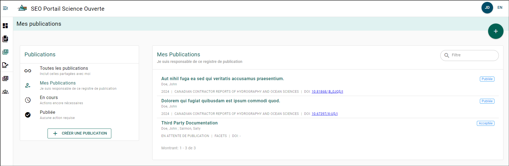
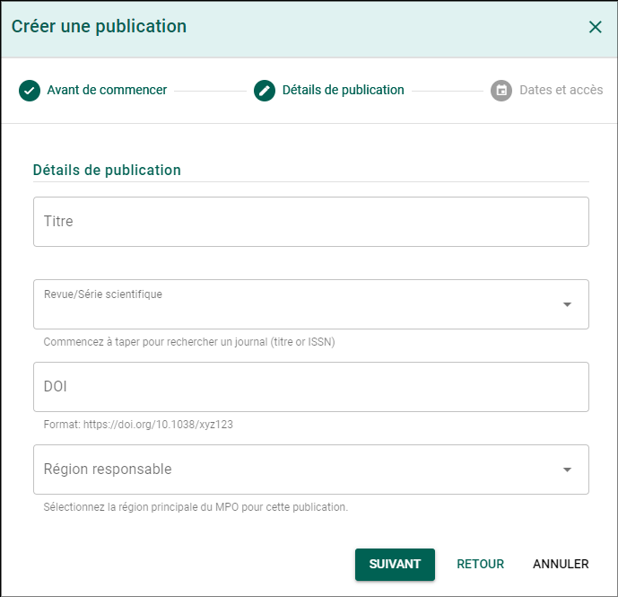
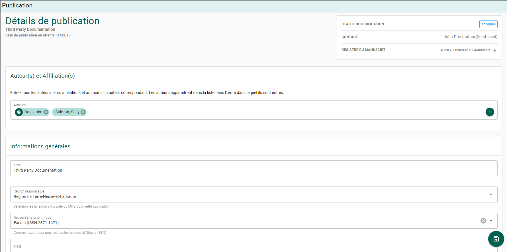
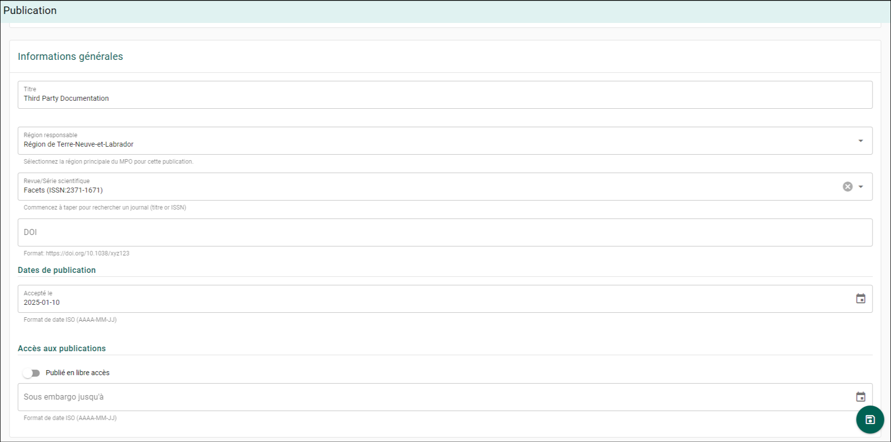
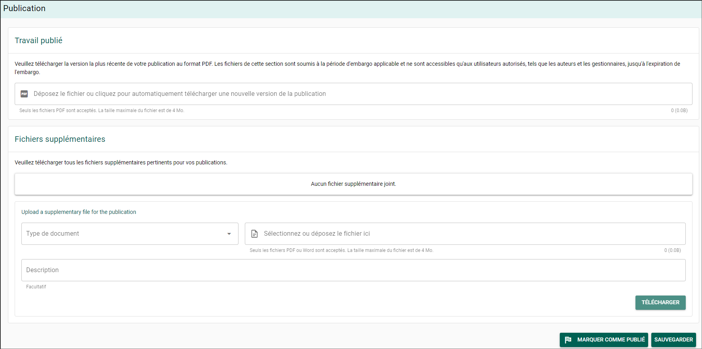
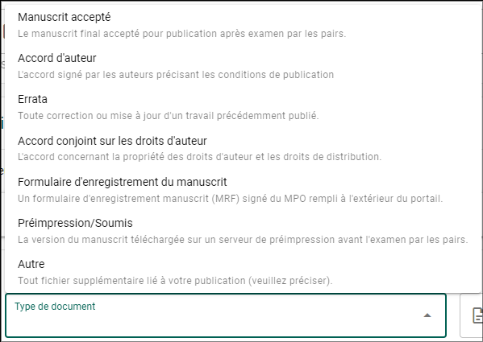
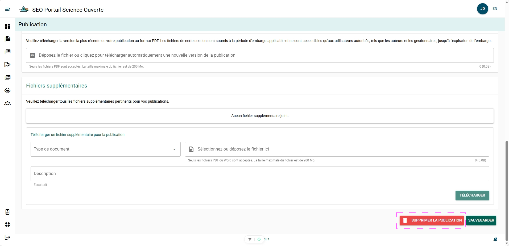

# Publications

## Page Mes publications {/* #my-publications-page */}

La page **Mes publications** vous permet de consulter tous les dossiers de publication que vous avez créés ou qui ont été partagés avec vous. À partir de cette page, vous pouvez créer de nouveaux dossiers de publication ou gérer ceux qui existent déjà.

Pour accéder à la page **Mes publications** :

1. Survolez le menu latéral de gauche pour développer le menu de navigation.
2. Cliquez sur **Mes publications**.

## Créer un dossier à partir d’une ancienne approbation de MRF (ancien formulaire) avant la publication {/* #creating-a-record-from-an-old-form-mrf-approval-prior-publication */}

Si vous avez terminé le processus d’approbation de l’ancien formulaire de MRF, mais que votre publication n’a pas encore été publiée, vous pouvez créer un dossier de publication à l’état **Accepté**. Cette situation peut se produire si vous étiez en cours de publication pendant la transition vers le PSO. En effectuant cette étape, votre rapport sera automatiquement transmis à **Publications scientifiques** afin d’être soumis aux bibliothèques.

**Étapes**

1. Cliquez sur **+ CRÉER UNE PUBLICATION** dans le menu **Publications**.
2. Cliquez sur **SUIVANT**.
3. Remplissez le formulaire **Détails de la publication**, puis cliquez sur **SUIVANT** :
   - Titre
   - Revue/Série
   - DOI (facultatif)
   - Région responsable
4. Remplissez le formulaire **Dates et accès**, puis cliquez sur **CRÉER** :
   - Accepté le (facultatif)
   - Publié le — **LAISSEZ CE CHAMP VIDE!**
   - Publié en libre accès

**Résultat**

Un dossier de publication ayant l’état **Accepté** est créé. Vous pouvez maintenant **[compléter les renseignements de votre dossier](./publications.mdx#updating-a-publication-record)**.

## Créer un dossier pour une publication existante {/* #creating-a-record-for-an-existing-publication */}

Si votre publication a été publiée avant l’adoption du PSO ou en dehors de celui-ci, la création d’un dossier de publication est un excellent moyen d’améliorer sa visibilité au sein du MPO et de contribuer à une archive numérique centralisée des documents associés à votre publication.

**Étapes**

1. Survolez le menu latéral de gauche pour développer le menu de navigation.
2. Sélectionnez **Mes publications**.
3. Cliquez sur le bouton **CRÉER UNE PUBLICATION**.
4. Cliquez sur le bouton **SUIVANT**.
5. Remplissez le formulaire **Détails de la publication**, puis cliquez sur **SUIVANT**.
   - Titre
   - Revue/Série
   - DOI (facultatif)
   - Région responsable
6. Remplissez le formulaire **Dates et accès à la publication**, puis cliquez sur **CRÉER**.
   - Accepté le (facultatif)
   - Publié le
   - Publié en libre accès
   - Sous embargo jusqu’au (le cas échéant)

Un nouveau dossier de publication est créé et le formulaire **Détails de la publication** s’ouvre automatiquement.

## Mettre à jour un dossier de publication {/* #updating-a-publication-record */}

Un dossier de publication peut évoluer après sa soumission à une revue. Il doit être mis à jour au fur et à mesure que de nouvelles métadonnées et de nouveaux documents deviennent disponibles.

Pour mettre à jour un dossier de publication :

1. Accédez à la page **Mes publications**.
2. Cliquez sur le dossier de publication que vous souhaitez mettre à jour.

### Auteur(s) et affiliation(s) {/* #authors-and-affiliations */}

#### Ajouter des auteurs et des affiliations {/* #adding-authors-and-affiliations */}

1. Cliquez sur le bouton **+**.
2. Cliquez dans le champ **Auteur**.
3. Commencez à saisir le nom de l’auteur ou de l’organisation à ajouter. Si le nom existe déjà dans la base de données, il s’affiche dans la liste. Sélectionnez-le. S’il n’apparaît pas :
   1. Cliquez sur le bouton **+** pour créer un nouvel auteur ou une nouvelle organisation.
   2. Saisissez le **prénom**, le **nom**, l’**organisation d’affiliation**, l’**adresse courriel** et l’**ORCID** (facultatif), puis cliquez sur **Créer**.
4. Indiquez si cette personne est l’**auteur-ressource**.
5. Cliquez sur **Ajouter** pour ajouter l’auteur ou l’organisation.
6. Répétez les étapes 1 à 5 jusqu’à ce que tous les auteurs et toutes les affiliations aient été ajoutés.

:::info
Un auteur qui ne possède pas d’adresse courriel valide, mais qui est mentionné dans la publication, n’a pas besoin d’être ajouté.
:::

#### Mettre à jour un auteur ou une affiliation {/* #updating-author-or-affiliation */}

Pour modifier le statut d'**auteur-ressource** d'un auteur ou d'une affiliation déjà ajouté :

1. Cliquez sur son nom.
2. Activez ou désactivez le curseur **Auteur-ressource**.

#### Retirer un auteur ou une affiliation {/* #removing-an-author-or-affiliate */}

Pour retirer un auteur ou une affiliation :

1. Cliquez sur l'icône **X** située à droite de son nom.

### Renseignements généraux {/* #general-information */}

#### Titre {/* #title */}

Pour mettre à jour le titre :

1. Cliquez dans le champ **Titre**.
2. Modifiez le titre.
3. Cliquez sur le bouton **ENREGISTRER** au bas de la page ou sur l'icône **Disquette**.

#### Région responsable {/* #lead-region */}

Pour mettre à jour la région responsable :

1. Cliquez dans le champ **Région responsable**.
2. Sélectionnez la nouvelle région dans la liste déroulante.
3. Cliquez sur le bouton **ENREGISTRER** au bas de la page ou sur l'icône **Disquette**.

#### Revue/Série {/* #journalseries */}

Pour mettre à jour la revue ou la série à laquelle le manuscrit a été soumis :

1. Cliquez dans le champ **Revue/Série**.
2. Saisissez le titre ou le **ISSN** de la publication.
3. Sélectionnez la revue ou la série dans la liste déroulante. Si elle n'apparaît pas, veuillez communiquer avec le **[soutien du PSO](mailto:DFO.OpenScience-ScienceOuverte.MPO@dfo-mpo.gc.ca)**.
4. Cliquez sur le bouton **ENREGISTRER** au bas de la page ou sur l'icône **Disquette**.

#### DOI {/* #doi */}

Pour ajouter ou mettre à jour l’identificateur d’objet numérique (**DOI**) de votre publication :

1. Cliquez dans le champ **DOI**.
2. Entrez le DOI au format suivant : `https://doi.org/10.1038/xyz123`.
3. Cliquez sur le bouton **ENREGISTRER** au bas de la page ou sur l’icône **Disquette**.

#### Dates de publication {/* #publication-dates */}

Pour mettre à jour la date d’acceptation de votre manuscrit :

1. Cliquez dans le champ **Accepté le**.
2. Entrez la date au format **AAAA-MM-JJ**, ou cliquez sur l’icône **Calendrier** pour sélectionner une date.
3. Cliquez sur le bouton **ENREGISTRER** au bas de la page ou sur l’icône **Disquette**.

#### Accès à la publication {/* #publication-access */}

Si votre publication a été publiée en **libre accès** :

1. Activez le bouton bascule **Publié en libre accès**.
2. Cliquez sur le bouton **ENREGISTRER** au bas de la page ou sur l’icône **Disquette**.

Si votre publication est assujettie à une **date d’embargo** :

1. Cliquez dans le champ **Sous embargo jusqu’au**.
2. Entrez la date au format **AAAA-MM-JJ**, ou cliquez sur l’icône **Calendrier** pour sélectionner une date.
3. Cliquez sur le bouton **ENREGISTRER** au bas de la page ou sur l’icône **Disquette**.

Pendant la période d’embargo, la copie téléversée de votre publication ne peut pas être téléchargée par les autres utilisateurs du PSO. Les utilisateurs autorisés, comme les auteurs et les gestionnaires, peuvent toutefois y accéder pendant toute la durée de l’embargo.

### Publication publiée {/* #published-work */}

Pour téléverser la version la plus récente de votre publication :

1. Cliquez dans la zone **Déposez un fichier ou cliquez pour téléverser automatiquement une nouvelle version de la publication**.
2. Repérez le fichier PDF de votre publication dans la fenêtre de sélection des fichiers, sélectionnez-le, puis cliquez sur **Ouvrir**.
3. Cliquez sur le bouton **ENREGISTRER** au bas de la page ou sur l’icône **Disquette**.

### Fichiers supplémentaires {/* #supplementary-files */}

Des fichiers supplémentaires peuvent être ajoutés à votre dossier de publication au fur et à mesure de leur création. Ces fichiers peuvent être au format **PDF** ou **Word** et servent à compléter le dossier de publication.

Pour téléverser un fichier supplémentaire :

1. Sélectionnez le champ **Type de document**.
2. Choisissez le type de document dans la liste.
3. Cliquez dans la zone **Sélectionnez ou déposez un fichier ici**, repérez votre fichier dans la fenêtre de sélection des fichiers, sélectionnez-le, puis cliquez sur **Ouvrir**.
4. Au besoin, ajoutez des renseignements dans le champ **Description**.
5. Répétez les étapes 1 à 4 pour ajouter plusieurs fichiers supplémentaires.
6. Cliquez sur le bouton **ENREGISTRER** au bas de la page ou sur l’icône **Disquette**.

### Marquer comme publiée ou enregistrer {/* #mark-as-published-or-save */}

Si la publication de vos travaux est confirmée :

1. Cliquez sur le bouton **MARQUER COMME PUBLIÉE**.

Votre publication passera à l’état **Publiée** et sera accessible dans **[l’Explorateur de publications](../portal-features/publication-explorer.mdx)**.

Si vous mettez à jour un dossier déjà publié ou si vous êtes toujours en attente de la confirmation de publication :

1. Cliquez sur le bouton **ENREGISTRER**.

## Supprimer un dossier de publication {/* #deleting-a-publication-record */}

Il peut arriver qu’un **dossier de publication** ait été créé, mais ne soit plus nécessaire dans le PSO. Par exemple, un dossier de publication en double peut avoir été créé et un seul doit être conservé.

:::important

Un **dossier de publication** créé dans le cadre des **[étapes communes du processus](./overview.mdx#common-process-steps)** du PSO ne peut **pas** être supprimé.

:::

Lorsqu’un dossier de publication est supprimé, il est retiré de l’application et placé dans la **file d’attente des suppressions**. Il y demeure pendant **90 jours** avant d’être supprimé définitivement. Pendant cette période, le dossier n’est plus accessible dans l’application, mais il peut être restauré par l’équipe de soutien technique du PSO.

Si vous avez supprimé un dossier de publication par erreur et souhaitez le récupérer, communiquez avec le **[soutien technique du PSO](mailto:DFO.OpenScience-ScienceOuverte.MPO@dfo-mpo.gc.ca)**.

:::danger

Un dossier de publication **ne peut plus être restauré** une fois le délai de **90 jours** écoulé.

:::

Pour supprimer un dossier de publication, vous devez être le **créateur du dossier** ou détenir le rôle de **rédacteur en chef** :

1. Ouvrez le dossier de publication que vous souhaitez supprimer.
2. Faites défiler la page jusqu’en bas.
3. Cliquez sur le bouton **Supprimer la publication**.
4. Cliquez sur **OK** dans la boîte de dialogue de confirmation.