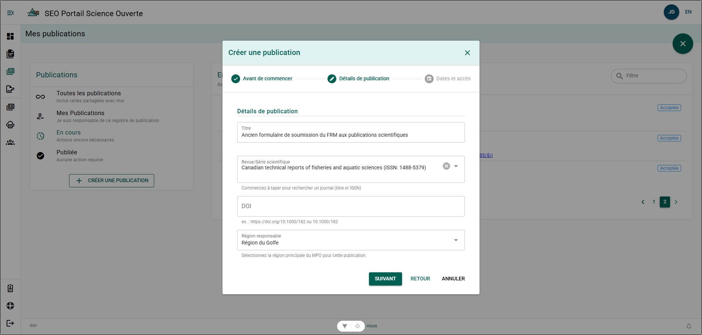
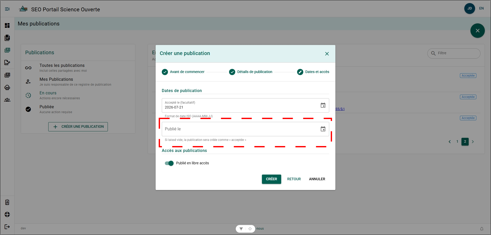

# Créer un formulaire de détails de publication

## Créer un dossier à partir d’un ancien formulaire MRF approuvé avant la publication {/* #creating-a-record-from-an-old-form-mrf-approval-prior-publication */}

Si vous avez obtenu l’approbation à l’aide de l’ancien formulaire MRF, mais que votre travail n’a pas encore été publié, vous pouvez créer un dossier de publication à l’état **Accepté**. Cette situation peut se produire si vous étiez en cours de processus de publication pendant la période de transition vers le PSO. Cette étape transmettra automatiquement votre rapport aux Publications scientifiques afin qu’il soit soumis aux Bibliothèques.

**Étapes**

1. Cliquez sur **+ CRÉER UNE PUBLICATION** dans le menu **Publications**.
2. Cliquez sur **SUIVANT**.
3. Remplissez le formulaire **Détails de la publication**, puis cliquez sur **SUIVANT** :
   - Titre
   - Revue/Série
   - DOI (facultatif)
   - Région responsable
4. Remplissez le formulaire **Dates et accès**, puis cliquez sur **CRÉER** :
   - Accepté le (facultatif)
   - Publié le – **LAISSEZ CE CHAMP VIDE!**
   - Publié en libre accès

**Résultat**

- Un nouveau formulaire de détails de publication est créé.
- Le nouveau formulaire de détails de publication est à l’état **Accepté**.
- Le dossier de publication est ajouté au tableau de bord du rédacteur.

## Créer un dossier pour une publication existante {/* #creating-a-record-for-an-existing-publication */}

Si votre travail a été publié à l’extérieur du PSO ou avant sa mise en œuvre, la création d’un dossier de publication pour votre travail constitue un excellent moyen d’accroître sa visibilité au sein du MPO et de contribuer à la création d’archives numériques centralisées pour les documents associés à votre publication.

**Étapes**

1. Survolez le menu latéral gauche pour développer le menu de sélection des pages.
2. Sélectionnez **Mes publications**.
3. Cliquez sur **CRÉER UNE PUBLICATION**.
4. Cliquez sur **SUIVANT**.
5. Remplissez le formulaire **Détails de la publication**, puis cliquez sur **SUIVANT** :
   - Titre
   - Revue/Série
   - DOI (facultatif)
   - Région responsable
6. Remplissez le formulaire **Dates de publication et accès à la publication**, puis cliquez sur **CRÉER** :
   - Accepté le (facultatif)
   - Publié le
   - Publié en libre accès
   - Sous embargo jusqu’au (s’il y a lieu)

**Résultat**

- Un nouveau formulaire de détails de publication est créé.

