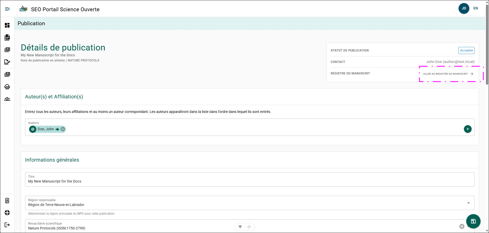
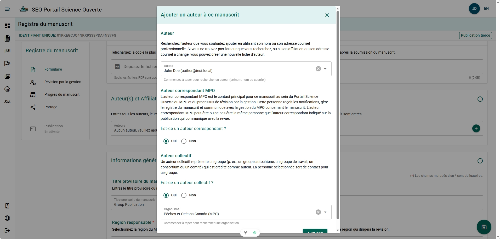
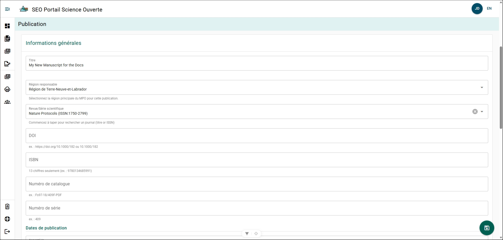
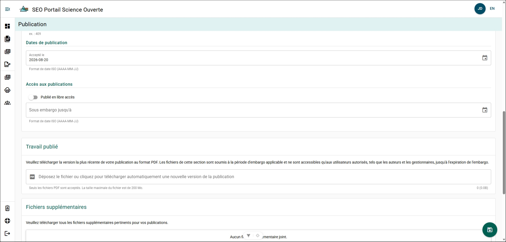
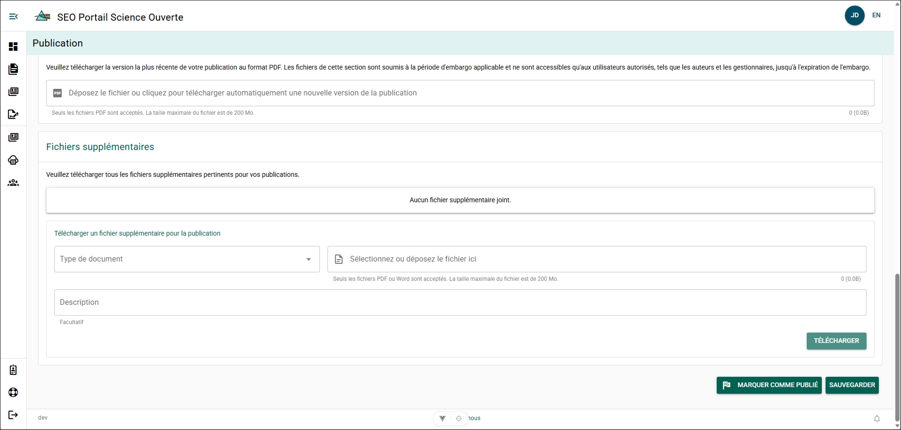

# Gérer un formulaire de détails de publication

Les détails d’une publication peuvent évoluer après sa soumission à une revue. Le formulaire de détails de publication devrait être mis à jour à mesure que des modifications sont apportées, que des métadonnées supplémentaires sont générées et que des documents sont créés.

:::tip
**Enregistrez votre progression**

Enregistrez fréquemment votre travail afin d’éviter de le perdre.

Vous pouvez enregistrer votre progression en :

- cliquant sur le bouton circulaire **Disquette** dans le coin inférieur droit de la page;
- faisant défiler le formulaire jusqu’en bas et en cliquant sur **Enregistrer**.

Après avoir enregistré vos modifications, vous pouvez fermer votre session du PSO en toute sécurité.
:::

Le formulaire de détails de publication est automatiquement créé à partir de votre MRF lorsque vous avez soumis votre manuscrit à l’éditeur. Vous pouvez retourner au MRF associé à ce formulaire de détails de publication en tout temps en cliquant sur **Accéder au dossier de manuscrit** dans le menu des détails situé dans le coin supérieur droit.

## Auteur(s) et affiliation(s) {/* #authors-and-affiliations */}

**Étapes**

Répétez ces étapes pour chaque auteur :

1. Cliquez sur **+**.
2. Recherchez l’auteur dans le champ **Auteur** à l’aide de son nom ou de son adresse courriel.
3. Sélectionnez **Oui** pour **Auteur correspondant** si l’auteur sera la principale personne-ressource au sein du MPO.
4. Sélectionnez **Oui** pour **Auteur collectif** si l’auteur représente un groupe, puis recherchez le groupe par son nom.
5. Cliquez sur **Enregistrer**.

**Résultat**

- Les auteurs sélectionnés sont ajoutés au formulaire de détails de publication.
- Les auteurs ajoutés peuvent consulter et modifier le formulaire de détails de publication, mais ne peuvent pas le supprimer.

:::info
Un auteur qui ne possède pas d’adresse courriel valide et qui est mentionné comme auteur de la publication n’a pas besoin d’être ajouté.
:::

## Renseignements généraux {/* #general-information */}

### Titre {/* #title */}

**Étapes**

1. Cliquez sur **Titre**.
2. Modifiez le texte du titre.
3. Cliquez sur **ENREGISTRER**.

**Résultat**

- Le titre du formulaire de détails de publication a été mis à jour.

### Région responsable {/* #lead-region */}

**Étapes**

1. Cliquez sur **Région responsable**.
2. Sélectionnez la région.
3. Cliquez sur **ENREGISTRER**.

**Résultat**

- La région responsable a été mise à jour.

### Revue/Série {/* #journalseries */}

**Étapes**

1. Cliquez sur **Revue/Série**.
2. Recherchez le numéro ISSN ou le titre de la revue ou de la série.
3. Sélectionnez la revue ou la série.
4. Cliquez sur **ENREGISTRER**.

**Résultat**

- La revue ou la série a été mise à jour.

**Informations supplémentaires**

- Si la revue ou la série ne figure pas dans la liste, veuillez communiquer par courriel avec [l’équipe de soutien du PSO](mailto:DFO.OpenScience-ScienceOuverte.MPO@dfo-mpo.gc.ca).

### DOI {/* #doi */}

**Étapes**

1. Cliquez sur **DOI**.
2. Entrez le DOI dans le format suivant : `https://doi.org/10.1038/xyz123`.
3. Cliquez sur **ENREGISTRER**.

**Résultat**

- Le DOI a été mis à jour.

**Informations supplémentaires**

- Pour les publications scientifiques et techniques secondaires de la DGEO, un DOI sera généré pour vous par l’équipe des Publications scientifiques.

### ISBN {/* #isbn */}

**Étapes**

1. Cliquez sur **ISBN**.
2. Entrez le numéro ISBN attribué.
3. Cliquez sur **Enregistrer**.

**Résultat**

- L’ISBN a été mis à jour.

### Numéro de catalogue {/* #catalog-number */}

**Étapes**

1. Cliquez sur **Numéro de catalogue**.
2. Entrez le numéro de catalogue attribué.
3. Cliquez sur **Enregistrer**.

**Résultat**

- Le numéro de catalogue a été mis à jour.

### Numéro de parution {/* #issue-number */}

**Étapes**

1. Cliquez sur **Numéro de parution**.
2. Entrez le numéro de parution attribué.
3. Cliquez sur **Enregistrer**.

**Résultat**

- Le numéro de parution a été mis à jour.

### Dates de publication {/* #publication-dates */}

#### Date d’acceptation {/* #accepted-on */}

**Étapes**

1. Cliquez sur **Accepté le**.
2. Sélectionnez la date.
3. Cliquez sur **Enregistrer**.

**Résultat**

- La date d’acceptation a été mise à jour.

#### Date de publication {/* #published-on */}

**Étapes**

1. Cliquez sur **Publié le**.
2. Sélectionnez la date.
3. Cliquez sur **Enregistrer**.

**Résultat**

- La date de publication a été mise à jour.

**Informations supplémentaires**

- La section **Publié le** ne sera pas visible tant que vous n’aurez pas marqué votre formulaire de détails de publication comme publié.

### Accès à la publication {/* #publication-access */}

#### Libre accès {/* #open-access */}

Par défaut, toutes les publications scientifiques et techniques secondaires de la DGEO sont publiées en libre accès!

**Étapes**

1. Cliquez sur **Publié en libre accès** pour activer l’option.

**Résultat**

- Le bouton bascule passe du gris au vert.
- La section **Sous embargo jusqu’au** disparaît.
- La publication est marquée comme étant en libre accès.

#### Autre accord de licence {/* #other-licencing-agreement */}

Certains éditeurs tiers imposent une période d’embargo pendant laquelle vous ne pouvez pas publier ou partager votre manuscrit ailleurs avant une date prédéterminée. La définition d’une date **Sous embargo jusqu’au** vous permet de marquer votre manuscrit comme publié tout en empêchant les utilisateurs du PSO de consulter votre publication avant cette date.

**Étapes**

1. Cliquez sur **Sous embargo jusqu’au**.
2. Sélectionnez la date.
3. Cliquez sur **Enregistrer**.

**Résultat**

- Votre publication ne sera pas visible par les utilisateurs du PSO avant que la date d’embargo sélectionnée soit passée.

**Informations supplémentaires**

- Les auteurs inscrits dans le formulaire de détails de publication, les rédacteurs de votre région et les utilisateurs ayant un rôle de directeur pourront télécharger et consulter votre manuscrit.
- Si le champ **Sous embargo jusqu’au** n’apparaît pas, assurez-vous que l’option **Publié en libre accès** est désactivée (grise).

### Travail publié {/* #published-work */}

La section **Travail publié** sert à téléverser une copie PDF de votre travail tel qu’il a été publié par l’éditeur.

**Étapes**

1. Cliquez sur **Déposez le fichier ou cliquez pour téléverser automatiquement une nouvelle version de la publication**.
2. Sélectionnez votre publication dans l’Explorateur de fichiers.
3. Cliquez sur **Enregistrer**.

**Résultat**

- Une copie PDF de votre travail publié a été téléversée.

**Informations supplémentaires**

- Si vous avez défini une date **Sous embargo jusqu’au**, votre travail publié ne sera pas visible par les utilisateurs du PSO avant que cette date soit passée.

## Fichiers supplémentaires {/* #supplementary-files */}

Des fichiers supplémentaires peuvent être téléversés dans votre dossier de publication à mesure qu’ils sont créés. Ces fichiers peuvent être au format PDF ou Word et devraient être téléversés afin de compléter le formulaire de détails de publication.

**Étapes**

1. Cliquez sur **Type de document**.
2. Sélectionnez le type de document.
3. Cliquez sur **Sélectionnez ou déposez un fichier ici**.
4. Sélectionnez le fichier dans l’Explorateur de fichiers.
5. Cliquez sur **Description** et entrez des renseignements contextuels (facultatif).
6. Cliquez sur **Téléverser**.

