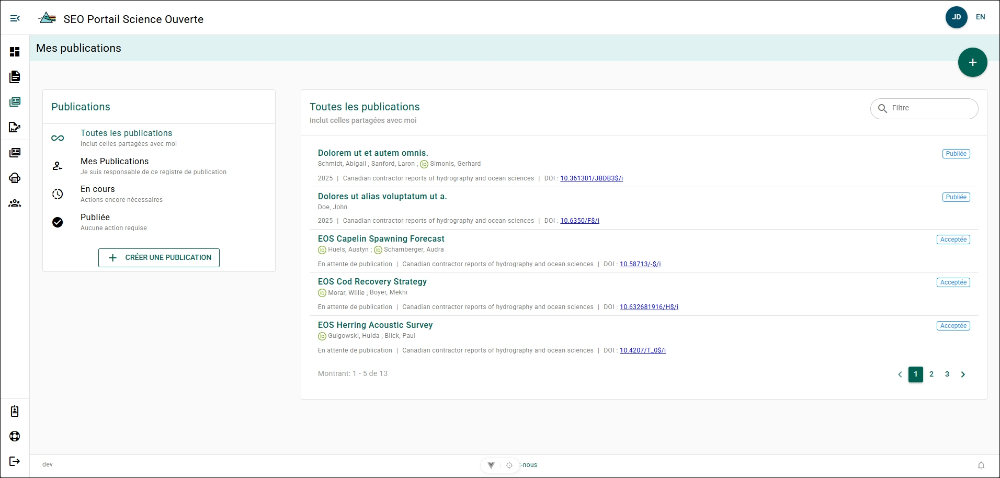

# Page Mes publications

La page **Mes publications** vous permet de consulter tous les dossiers de publication que vous avez créés ou qui ont été partagés avec vous. À partir de cette page, vous pouvez créer de nouveaux dossiers de publication ou gérer les dossiers existants.

## Étiquettes de toutes les publications {/* #all-publications-labels */}

- **ORCID** : Un cercle vert avec les lettres « iD » à gauche du nom d’un auteur indique que l’auteur a associé un [ORCID](../references/orcid) à son compte.
- **Année de publication** : L’année de publication apparaît en gris, ou la mention « Publication en attente » s’affiche si le formulaire de dossier de publication n’a pas été marqué comme publié.
- **Revue** : Le nom de la revue ou de la série à laquelle la publication a été soumise.
- **DOI** : L’hyperlien vers l’[identifiant numérique d’objet (DOI)](https://www.doi.org/) de la publication.
- **État** : La mention « Accepté » ou « Publié » apparaît en bleu dans une étiquette bleue. Cet état indique si la publication a été marquée comme publiée ou non.

