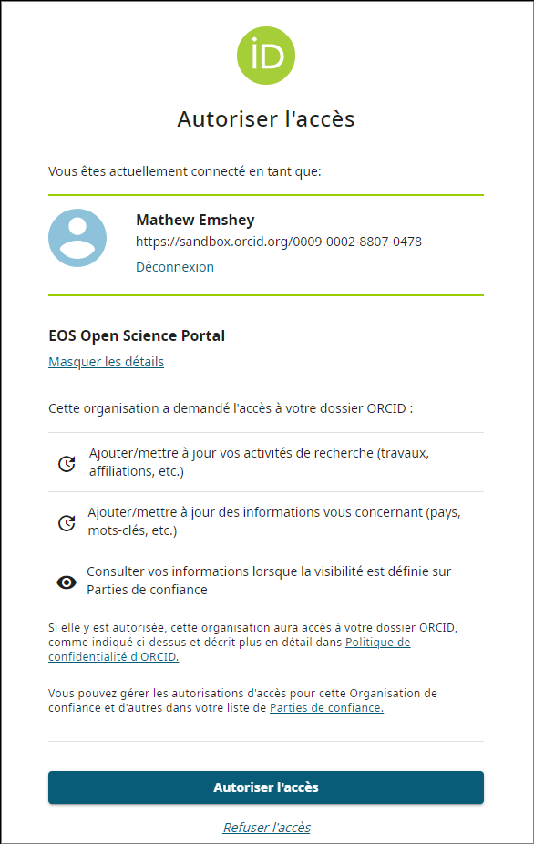
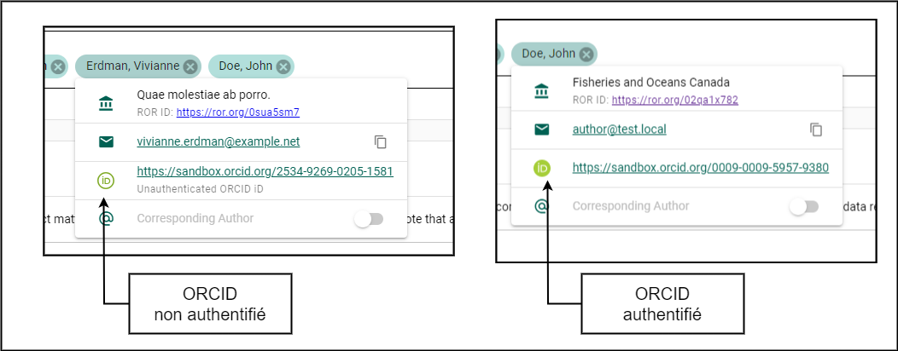
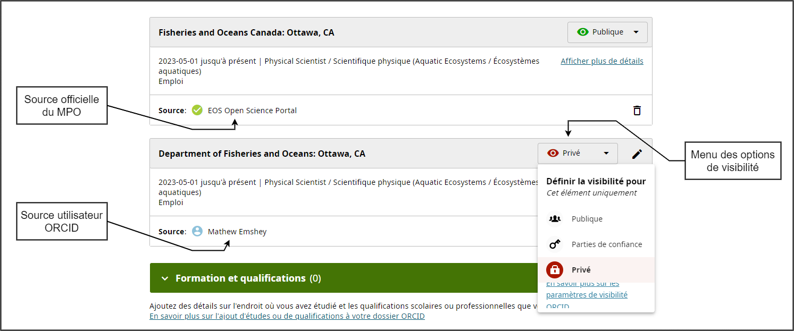
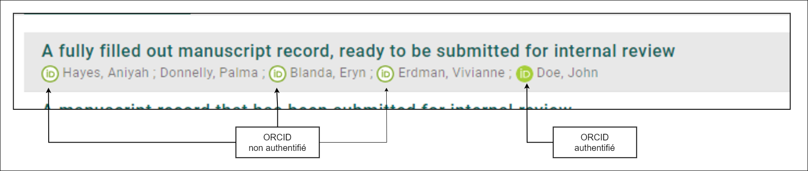
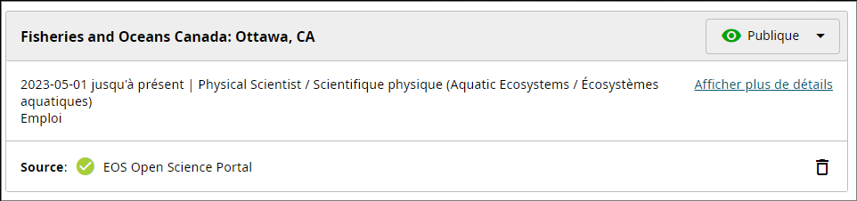
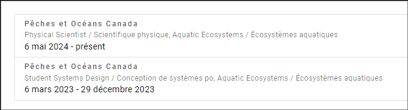

# ORCID

[ORCID (Open Researcher and Contributor ID)](https://orcid.org/) est un identifiant numérique persistant (PID) unique qui permet de distinguer les chercheurs et leurs travaux. Il relie les contributions, comme les articles, les ensembles de données et les évaluations, entre les organisations, les revues et les organismes de financement. ORCID permet aux chercheurs de recevoir l’attribution et la reconnaissance appropriées pour leurs travaux, même lorsqu’ils changent d’établissement ou de rôle.

ORCID simplifie la collecte de données et la production de rapports, améliore la collaboration et la visibilité entre les projets et facilite la gestion des profils de chercheurs. Cela favorise la transparence et la continuité des activités scientifiques.

## Créer un ORCID {/* #create-an-orcid */}

Si vous **n’avez pas encore** de compte ORCID :

**Étapes**

1. Connectez-vous à [**osp-pso.ent.dfo-mpo.ca**](https://osp-pso.ent.dfo-mpo.ca/).
2. Cliquez sur **Menu utilisateur** dans le coin supérieur droit de la page.
3. Sélectionnez **Paramètres**.
4. Cliquez sur **Profil d’auteur**.
5. Cliquez sur **CRÉER OU CONNECTER VOTRE IDENTIFIANT ORCID** dans la section **Intégration ORCID**.
6. Cliquez sur le lien **S’inscrire maintenant** sous l’en-tête **Se connecter à ORCID**.
7. Remplissez le formulaire d’inscription et cliquez sur **Étape suivante**.

:::tip
Il est recommandé d’utiliser votre adresse courriel personnelle comme **Adresse courriel principale**, puisque votre profil ORCID est personnel et n’est pas lié au MPO.  
Vous pouvez utiliser votre adresse courriel @dfo-mpo.gc.ca comme **Adresse courriel secondaire**.
:::

8. Configurez votre mot de passe et cliquez sur **Étape suivante**.
9. Passez le formulaire *Emploi actuel* en cliquant sur **Passer cette étape sans ajouter d’affiliation** sous le bouton **Étape suivante**.  
    - (Votre **Dossier d’emploi** sera ajouté dans la section [Ajouter un emploi par l’intermédiaire du PSO](#add-employment-through-the-osp).)
10. Choisissez le niveau de visibilité souhaité pour votre profil et cliquez sur **Étape suivante**.
11. Acceptez les conditions d’utilisation d’ORCID et cliquez sur **Terminer l’inscription**.
12. Cliquez sur **Autoriser l’accès**.  
    - Pour obtenir des détails sur les autorisations que vous accordez au PSO, consultez [Autoriser l’accès](#authorize-access).
13. Cliquez sur **CONTINUER** pour terminer le processus.
14. Consultez la boîte de réception de votre adresse courriel principale et cliquez sur **Vérifier votre adresse courriel**.

**Résultat**

- Votre compte ORCID est maintenant créé, vérifié et lié à votre profil PSO!

## Ajouter un ORCID existant à votre profil PSO {/* #add-an-existing-orcid-to-your-osp-profile */}

Si vous avez **déjà** un compte ORCID et souhaitez le lier à votre profil PSO :

**Étapes**

1. Connectez-vous à [**osp-pso.ent.dfo-mpo.ca**](https://osp-pso.ent.dfo-mpo.ca/).
2. Cliquez sur **Menu utilisateur** dans le coin supérieur droit de la page.
3. Sélectionnez **Paramètres**.
4. Cliquez sur **Profil d’auteur**.
5. Cliquez sur **CRÉER OU CONNECTER VOTRE IDENTIFIANT ORCID** dans la section **Intégration ORCID**.
6. Connectez-vous à votre compte ORCID existant et cliquez sur **Se connecter à ORCID**.
7. Cliquez sur **Autoriser l’accès**.  
    - Pour obtenir des détails sur les autorisations que vous accordez, consultez [Autoriser l’accès](#authorize-access).
8. Cliquez sur **CONTINUER**.

**Résultat**

- Votre compte ORCID est maintenant lié à votre profil PSO!

## Autoriser l’accès {/* #authorize-access */}

Afin d’optimiser votre expérience avec ORCID par l’intermédiaire du PSO, nous vous recommandons d’autoriser le PSO à mettre à jour votre profil ORCID en votre nom. Cette autorisation confirme votre affiliation au MPO et permet au PSO d’ajouter automatiquement à votre profil ORCID des renseignements tels que vos affiliations, vos domaines d’expertise et vos contributions à la recherche.

En gérant vos dossiers d’emploi par l’intermédiaire du PSO, vous permettez l’affichage d’un badge officiel du MPO comme source dans votre profil ORCID. Ce badge fournit des renseignements d’identification visibles et vérifiés qui renforcent votre profil professionnel.

## Gérer les dossiers d’emploi {/* #manage-employment-records */}

Lier votre emploi au MPO à votre profil ORCID par l’intermédiaire du PSO accroît la crédibilité de votre profil et contribue à améliorer sa visibilité et sa fiabilité au sein de la communauté scientifique.

### Ajouter un emploi par l’intermédiaire du PSO {/* #add-employment-through-the-osp */}

Pour ajouter un dossier d’emploi par l’intermédiaire du PSO :

**Étapes**

1. Ouvrez la page **Profil d’auteur**.
2. Cliquez sur **AJOUTER UN EMPLOI**.
3. Remplissez le formulaire *Ajouter un emploi au MPO à ORCID* :
   - **Organisation** : Pêches et Océans Canada (prérempli par défaut)
   - **Direction générale** : Sciences des écosystèmes et des océans / Ecosystems and Oceans Science
   - **Rôle/Titre du poste** : Par exemple, *Biologiste / Biologist*
   - Laissez la **Date de fin** vide si vous ajoutez votre poste actuel.
4. Cliquez sur **CRÉER**.

:::tip
**Pratique exemplaire :** Indiquez votre direction générale et le titre de votre poste en français et en anglais!  
Consultez les [Pratiques exemplaires](#best-practices) pour obtenir des conseils supplémentaires.
:::

**Résultat**

- Un dossier d’emploi a été ajouté à votre profil ORCID.

### Masquer les dossiers d’emploi dont la source n’est pas le MPO {/* #hide-non-dfo-sourced-employment */}

Lorsque vous créez votre compte ORCID, vous pouvez ajouter votre emploi actuel, qui sera affiché comme étant *fourni par votre compte utilisateur ORCID*. Toutefois, il est recommandé que tous les dossiers liés à vos activités au MPO comprennent le badge de source du MPO, conformément aux [Pratiques exemplaires ORCID](#best-practices).

Pour masquer votre dossier d’emploi que vous avez ajouté vous-même :

**Étapes**

1. Ajoutez vos dossiers d’emploi actuels et/ou antérieurs en suivant les étapes de la section [Ajouter un emploi par l’intermédiaire du PSO](#add-employment-through-the-osp).
2. Connectez-vous à votre compte ORCID à [orcid.org](https://orcid.org/signin).
3. Dans la section *Emploi*, trouvez le dossier d’emploi portant la mention **Source : *Votre nom***.
4. Cliquez sur **Visibilité** dans le coin supérieur droit du dossier pour afficher les *Paramètres de visibilité*.
    - Les options de visibilité comprennent **Tout le monde**, **Parties de confiance** ou **Moi uniquement**, selon le paramètre choisi lors de la création du compte.
5. Sélectionnez **Moi uniquement** pour masquer le dossier d’emploi.

**Résultat**

- Le dossier d’emploi est maintenant masqué dans votre profil ORCID.

### Modifier les dossiers d’emploi {/* #edit-employment-records */}

Pour modifier un dossier d’emploi :

**Étapes**

1. Ouvrez la page **Profil d’auteur**.
2. Sélectionnez le dossier d’emploi que vous souhaitez modifier.
3. Modifiez les renseignements dans le formulaire **Modifier votre dossier d’emploi au MPO dans ORCID**.
4. Cliquez sur **ENREGISTRER**.

**Résultat**

- Le dossier d’emploi a été modifié.

### Supprimer les dossiers d’emploi {/* #delete-employment-records */}

Pour supprimer un dossier d’emploi :

**Étapes**

1. Ouvrez la page **Profil d’auteur**.
2. Sélectionnez le dossier d’emploi.
3. Cliquez sur **SUPPRIMER**.
4. Confirmez l’action.

**Résultat**

- Le dossier d’emploi a été supprimé du PSO et d’ORCID.

## Déconnecter votre ORCID {/* #disconnect-your-orcid */}

Une fois votre ORCID déconnecté, le PSO supprimera toutes les clés et tous les jetons utilisés pour modifier votre profil ORCID, empêchant ainsi toute mise à jour ultérieure par le PSO. Toutefois, les modifications apportées précédemment par le PSO demeureront dans votre profil ORCID.

Pour déconnecter votre profil ORCID de votre compte PSO :

**Étapes**

1. Ouvrez la page **Profil d’auteur**.
2. Cliquez sur **DÉCONNECTER VOTRE IDENTIFIANT ORCID**.
3. Confirmez l’action.

**Résultat**

- Votre ORCID n’est plus associé à votre profil PSO.

**Informations supplémentaires**

- Pour supprimer ou modifier les changements apportés précédemment, connectez-vous à votre compte sur le [site Web d’ORCID](https://orcid.org/).
- Si vous souhaitez reconnecter votre profil ORCID à votre compte PSO, suivez les étapes de la section [Ajouter un ORCID existant à votre profil PSO](#add-an-existing-orcid-to-your-osp-profile).

## Pratiques exemplaires {/* #best-practices */}

Voici les pratiques exemplaires recommandées pour l’utilisation d’ORCID dans le contexte du PSO.

### Authentifier votre ORCID {/* #authenticate-your-orcid */}

L’authentification de votre compte ORCID permet au PSO de mettre à jour votre profil ORCID avec des renseignements provenant d’une source officielle du MPO. Suivez les étapes de la section [Ajouter un ORCID existant à votre profil PSO](#add-an-existing-orcid-to-your-osp-profile) pour authentifier votre compte. Si vous n’avez pas de compte ORCID, vous pouvez en créer un par l’intermédiaire du PSO en suivant les étapes de la section [Créer un ORCID](#create-an-orcid).

### Utiliser le badge de source officiel du MPO {/* #use-the-official-dfo-source-badge */}

Les dossiers d’emploi ajoutés par l’intermédiaire du site Web d’ORCID indiquent que vous en êtes la source, tandis que ceux ajoutés par l’intermédiaire du PSO affichent un badge de source officiel du MPO. Ajoutez de nouveau par l’intermédiaire du PSO tout dossier lié au MPO afin que ce badge y soit associé.

Consultez l’exemple dans [Masquer les dossiers d’emploi dont la source n’est pas le MPO](#hide-non-dfo-sourced-employment) pour voir une comparaison visuelle des badges de source.

### Organisation et titre du poste bilingues {/* #bilingual-organization-and-role-title */}

- Indiquez les versions française et anglaise de votre organisation et du titre de votre poste.
- Choisissez l’ordre des langues (anglais/français ou français/anglais) selon votre préférence.
- Séparez les deux langues par une barre oblique `/`.
    - Exemple : **Anglais / Français** ou **Français / Anglais**

### Mettre à jour vos dossiers d’emploi lorsque votre situation d’emploi change {/* #update-employment-records-when-your-employment-changes */}

Gardez vos dossiers d’emploi ORCID à jour, particulièrement lorsque vous cessez d’occuper un poste au MPO, y compris un poste par intérim. Assurez-vous d’ajouter une **Date de fin** à ces dossiers par l’intermédiaire du PSO. Cela permet de maintenir un historique d’emploi clair, professionnel et exact.

