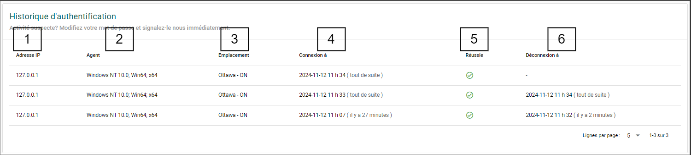

# Sécurité du compte

## Historique d’authentification {/* #authentication-history */}

Le Portail de science ouverte conserve un historique des tentatives de connexion pour chaque compte utilisateur. Cet historique fournit un aperçu de l’activité de connexion et vous permet de surveiller les tentatives d’accès non autorisé.

:::danger
Si vous remarquez plusieurs tentatives de connexion dans un court laps de temps ou toute autre activité suspecte :

- Avisez [l’équipe de soutien du Portail de science ouverte](mailto:DFO.OpenScience-ScienceOuverte.MPO@dfo-mpo.gc.ca).
:::

### Détails de l’historique d’authentification {/* #authentication-history-breakdown */}

**1 - Adresse IP**

La colonne **Adresse IP** indique l’adresse Internet associée à l’ordinateur qui tente de se connecter à votre compte.

**2 - Agent**

La colonne **Agent** indique le système d’exploitation de l’ordinateur qui tente de se connecter à votre compte.

**3 - Emplacement**

La colonne **Emplacement** indique l’emplacement géographique approximatif associé à l’adresse IP.

:::tip
Si vous vous connectez au Portail de science ouverte à l’aide d’un VPN, cet emplacement peut être différent de votre emplacement actuel.
:::

**4 - Connexion à**

La colonne **Connexion à** indique la date et l’heure auxquelles une tentative de connexion à votre compte a été effectuée. L’heure affichée est basée sur l’heure de votre ordinateur.

**5 - Réussie**

La colonne **Réussie** indique si la connexion à votre compte a réussi ou non. Si la connexion a réussi, une coche verte s’affiche. Si elle a échoué, une croix rouge s’affiche.

**6 - Déconnexion à**

La colonne **Déconnexion à** indique la date et l’heure auxquelles votre compte a été déconnecté. L’heure affichée est basée sur l’heure de votre ordinateur.
