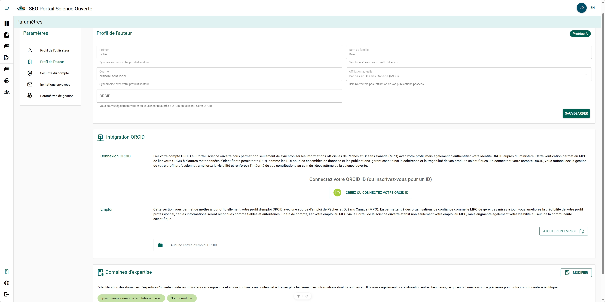
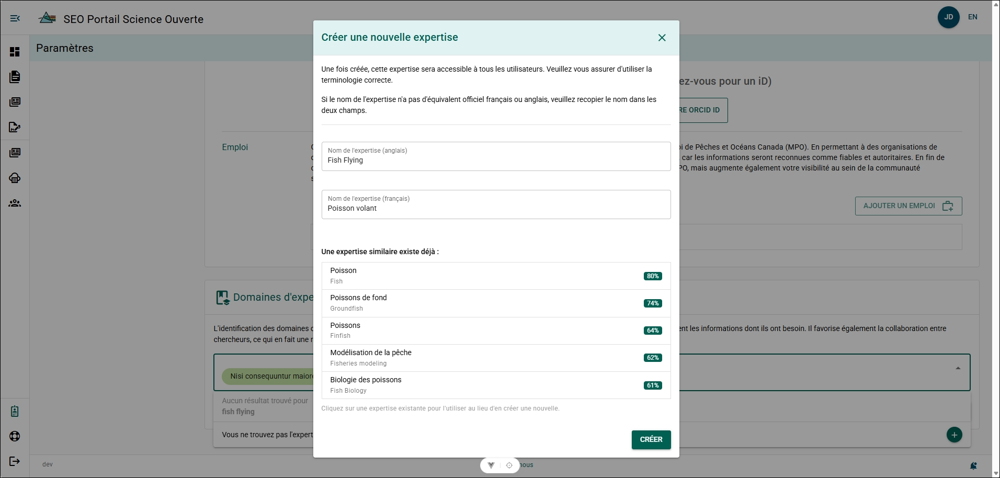

# Page Profil d’auteur

Le **Profil d’auteur** vous permet de définir des renseignements qui faciliteront vos échanges avec d’autres chercheurs du MPO et vous aideront à maintenir votre ORCID à jour.

## Profil d’auteur {/* #author-profile */}

Les renseignements de votre profil d’auteur sont synchronisés à partir de votre [Profil d’utilisateur](./user-profile).

**Informations supplémentaires**

- Le PSO est accessible uniquement à partir de l’intranet du MPO. Par conséquent, votre adresse courriel et votre affiliation actuelle ne peuvent pas être modifiées. Si vous souhaitez faire créer un compte d’auteur externe au MPO, veuillez communiquer avec [l’équipe de soutien du Portail de science ouverte](mailto:DFO.OpenScience-ScienceOuverte.MPO@dfo-mpo.gc.ca).

### ORCID {/* #orcid */}

Si vous possédez un ORCID, mais que vous **ne souhaitez pas** authentifier votre compte PSO avec ORCID, vous pouvez l’ajouter manuellement à votre profil d’auteur. Il est toutefois fortement recommandé de connecter et d’authentifier votre compte PSO avec votre ORCID. Consultez la [section ORCID](../references/orcid) pour obtenir de plus amples renseignements.

**Étapes**

1. Cliquez sur **ORCID**.
2. Entrez votre identifiant ORCID.
3. Cliquez sur **Enregistrer**.

**Résultat**

- Votre identifiant ORCID a été ajouté à votre profil d’auteur.
- Un symbole ORCID non authentifié apparaîtra à côté de votre nom dans le PSO.

## Intégration ORCID {/* #orcid-integration */}

Le PSO permet de connecter et d’authentifier votre **Open Researcher and Contributor ID (ORCID)** avec votre compte PSO. Cette intégration permet de gérer vos dossiers ORCID à partir du PSO avec une identification officielle du MPO.

Pour obtenir des instructions détaillées sur l’intégration ORCID et sur la façon de connecter votre compte ORCID au PSO, consultez la [section ORCID](../references/orcid).

## Domaines d’expertise {/* #areas-of-expertise */}

La section **Domaines d’expertise** vous permet d’ajouter les domaines dans lesquels vous êtes spécialiste. L’ajout de domaines d’expertise facilite vos échanges avec d’autres auteurs.

**Étapes**

1. Cliquez sur **MODIFIER**.
2. Cliquez sur le champ **Domaines d’expertise** pour le sélectionner.
3. Entrez votre domaine d’expertise.
4. Sélectionnez votre domaine d’expertise dans la liste filtrée.
5. Cliquez sur **ENREGISTRER**.

**Résultat**

- Le domaine d’expertise a été ajouté à votre profil d’auteur.

**Informations supplémentaires**

- Vous pouvez associer plusieurs domaines d’expertise à votre profil d’auteur.

### Si votre domaine d’expertise ne figure pas dans la liste {/* #if-your-area-of-expertise-is-not-listed */}

Si votre domaine d’expertise ne figure pas dans les résultats de recherche, vous pouvez l’ajouter au PSO!  
Une fois qu’un domaine d’expertise est créé, il devient accessible à tous les utilisateurs du PSO.

**Étapes**

1. Cliquez sur **MODIFIER**.
2. Cliquez sur le champ **Domaines d’expertise** pour le sélectionner.
3. Entrez votre domaine d’expertise.
4. Cliquez sur **Vous ne trouvez pas le domaine d’expertise que vous recherchez? +**.
5. Entrez le nom du domaine d’expertise en anglais et en français (utilisez le même nom dans les deux champs de langue s’il n’existe pas d’équivalent en français ou en anglais).
6. Cliquez sur **CRÉER**.

**Résultat**

- Le domaine d’expertise a été ajouté à votre profil d’auteur.
- Le domaine d’expertise a été ajouté au PSO et est maintenant accessible aux autres auteurs.

