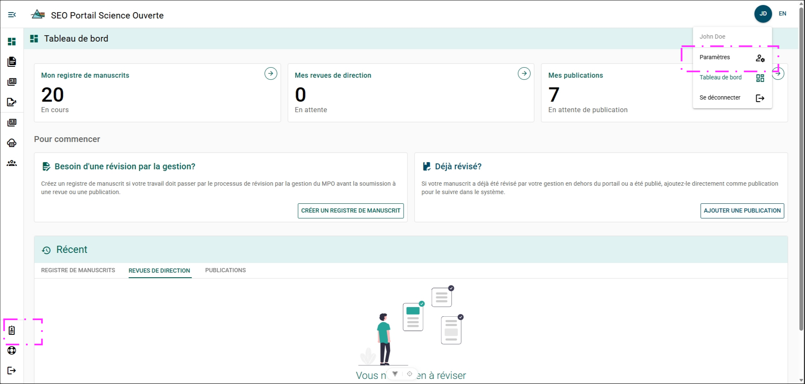

# Paramètres

## Accéder au menu Paramètres {/* #accessing-settings-menu */}

**Étapes**

1. Cliquez sur **Vos initiales**.
2. Cliquez sur **Paramètres**.

**Résultat**

- La page **Paramètres de l’utilisateur** s’ouvre.

**Autre méthode**

1. Cliquez sur **Profil d’auteur**.

**Résultat**

- La page **Profil d’auteur** du menu Paramètres s’ouvre.

