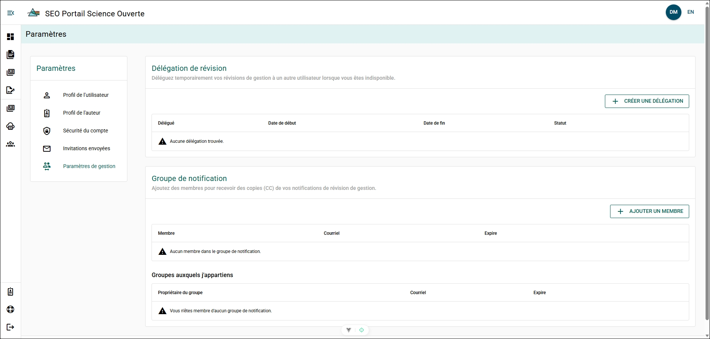
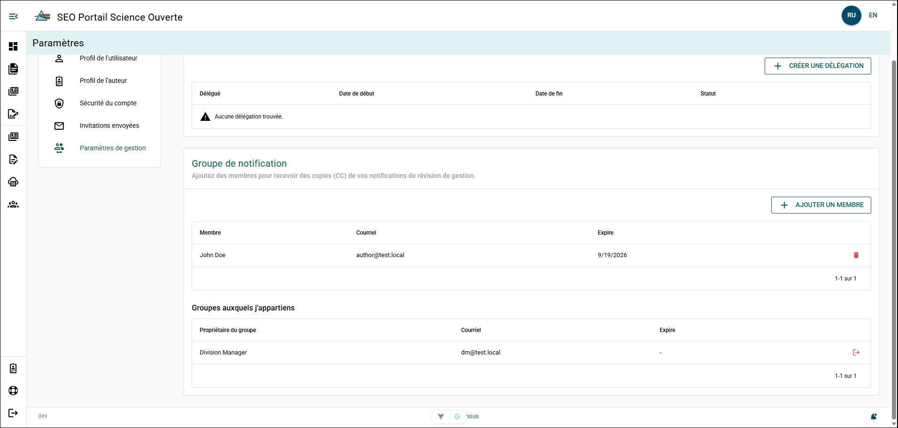
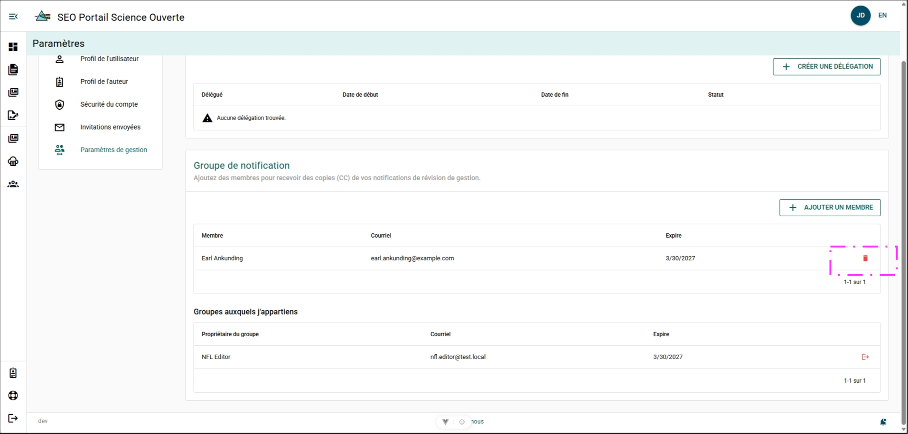
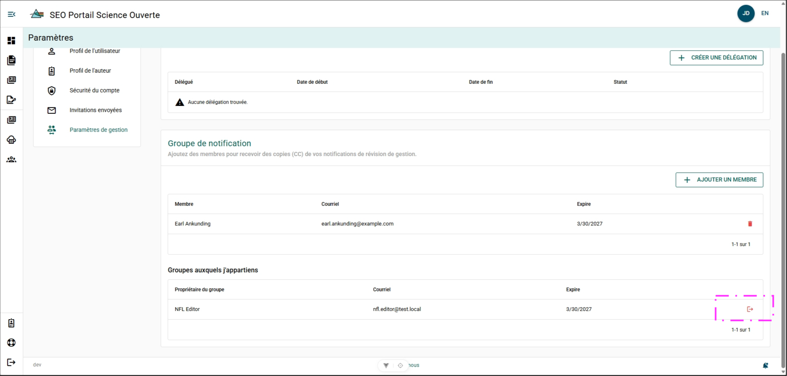

# Paramètres de gestion

## Délégation des examens {/* #review-delegation */}

La délégation des examens vous permet de désigner un autre utilisateur pour effectuer des examens de gestion du manuscrit en votre nom pendant une période déterminée. Une délégation des examens est généralement créée lorsque vous prévoyez prendre un congé ou occuper un poste par intérim.

Des instructions détaillées sur la création et la gestion d’une délégation des examens se trouvent dans la section [Examen de gestion du manuscrit](../manuscript-management-review/delegating).

## Groupe de notification {/* #notification-group */}

Le groupe de notification vous permet de sélectionner les utilisateurs qui recevront les courriels relatifs à l’examen de gestion du manuscrit que le PSO vous envoie.

Les courriels relatifs à l’examen de gestion du manuscrit que les membres de votre groupe de notification recevront comprennent :

- Soumission d’un manuscrit à l’examen de gestion du manuscrit
- Notifications relatives aux étapes de l’examen (nouvel examinateur désigné)
- Annulation par l’auteur de la soumission d’un manuscrit à l’examen de gestion du manuscrit
- Rappels d’échéance ou de retard de l’examen de gestion
- Résumés hebdomadaires des examens de gestion en attente
- Notifications indiquant que l’examen de gestion est terminé
- Notifications de création d’une délégation
- Rappels concernant le Cahier de planification

### Ajouter un membre à votre groupe de notification {/* #add-member-to-your-notification-group */}

**Étapes**

1. Cliquez sur **+ AJOUTER UN MEMBRE**.
2. Remplissez le formulaire :
    - **Utilisateur** – Sélectionnez l’utilisateur qui doit recevoir les courriels.
    - **Expiration** (facultatif) – Sélectionnez la date à laquelle l’utilisateur doit cesser de recevoir les courriels.
3. Cliquez sur **ENREGISTRER**.

**Résultat**

- L’utilisateur est ajouté à votre groupe de notification.

### Retirer un membre de votre groupe de notification {/* #remove-member-from-your-notification-group */}

**Étapes**

1. Cliquez sur **Supprimer** à la fin de la ligne de l’utilisateur.

**Résultat**

- L’utilisateur est retiré de votre groupe de notification.
- L’utilisateur recevra un courriel l’informant de ce changement.

#### Vous retirer d’un groupe de notification {/* #remove-yourself-from-a-notification-group */}

**Étapes**

1. Cliquez sur **Quitter** à la fin de la ligne du groupe de notification.

**Résultat**

- Vous êtes retiré de ce groupe de notification.
- Le propriétaire du groupe recevra un courriel l’informant de ce changement.

