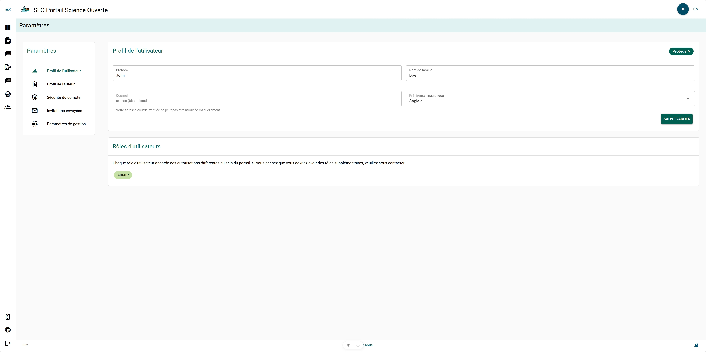

# Profil d’utilisateur

La page **Profil d’utilisateur** vous permet de modifier la façon dont votre nom apparaît dans le PSO ainsi que la langue dans laquelle le PSO s’ouvre par défaut. Les données de votre profil d’utilisateur sont automatiquement renseignées à partir de vos identifiants Microsoft du MPO.

### Prénom et nom de famille {/* #first-and-last-name */}

Le **prénom et le nom de famille** associés à votre compte apparaissent en gris. Si vous souhaitez modifier le nom associé à votre compte :

**Étapes**

1. Cliquez sur le **champ Nom**.
2. Modifiez le nom.
3. Cliquez sur **Enregistrer**.

**Résultat**

- Le nom a été mis à jour.

### Adresse courriel {/* #email */}

L’adresse courriel associée à votre compte apparaît en gris et ne peut pas être modifiée. Cette adresse courriel est également utilisée pour vous connecter à votre compte du Portail de science ouverte. Si vous souhaitez modifier votre adresse courriel, veuillez communiquer par courriel avec [l’équipe de soutien du Portail de science ouverte](mailto:DFO.OpenScience-ScienceOuverte.MPO@dfo-mpo.gc.ca).

### Langue par défaut {/* #default-language */}

La langue par défaut de votre compte apparaît dans ce champ. Si vous souhaitez modifier votre langue par défaut :

1. Cliquez sur **Langue par défaut**.
2. Sélectionnez la langue par défaut souhaitée.
3. Cliquez sur **Enregistrer**.

**Résultat**

- La langue par défaut de votre compte PSO a été mise à jour.

## Rôles des utilisateurs {/* #user-roles */}

Les rôles des utilisateurs déterminent le type de compte dont vous disposez. Tous les utilisateurs se voient attribuer le rôle **Auteur** lors de la création de leur compte.

Envoyez un courriel à [l’équipe de soutien du PSO](mailto:DFO.OpenScience-ScienceOuverte.MPO@dfo-mpo.gc.ca) pour ajouter ou supprimer des rôles associés à votre compte.

### Tableau récapitulatif des autorisations {/* #permission-summary-table */}

| Autorisation | Auteur (par défaut) | Directeur | Rédacteur | Rédacteur en chef | Rédacteur régional | Observateur régional |
|------------|:-------------------:|:---------:|:---------:|:-----------------:|:-------------------:|:---------------------:|
| Créer des dossiers de manuscrit | ✓ | ✓ | ✓ | ✓ | ✓ | ✓ |
| Créer des publications | ✓ | ✓ | ✓ | ✓ | ✓ | ✓ |
| Modifier tous les auteurs | ✗ | ✗ | ✓ | ✓ | Régional | ✗ |
| Effectuer l’examen de gestion | ✗ | ✓ | ✗ | ✗ | ✗ | ✗ |
| Consulter tous les dossiers de manuscrit | ✗ | ✓ | ✓ | ✓ | Régional | Régional |
| Modifier toutes les publications | ✗ | ✗ | ✓ | ✓ | Régional | ✗ |
| Supprimer toutes les publications | ✗ | ✗ | ✗ | ✓ | ✗ | ✗ |
| Publier les publications secondaires de la DGEO | ✗ | ✗ | ✗ | ✓ | ✗ | ✗ |
| Modifier les affiliations des auteurs | ✗ | ✗ | ✓ | ✓ | ✗ | ✗ |
