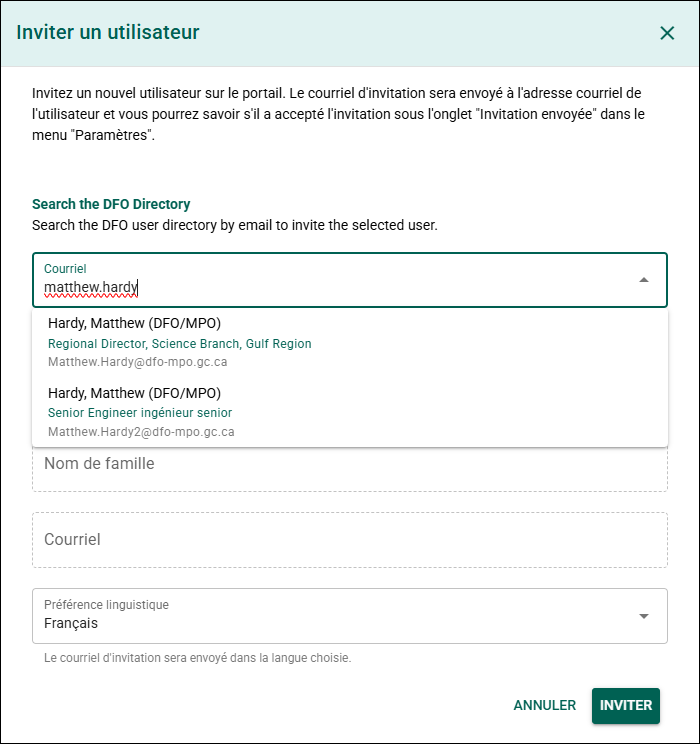

# Fonctionnalités supplémentaires

## Créer une nouvelle organisation {/* #create-a-new-organization */}

Créez une nouvelle organisation si l’organisation ou le groupe requis n’apparaît pas dans la **liste des organisations** du PSO. Cette fonctionnalité est généralement utilisée pour les groupes autochtones, les groupes de travail à long terme ou les organisations qui ne sont pas déjà enregistrées dans le système.

:::important
Utilisez le **nom officiel** de l’organisation lors de la création d’un nouveau dossier.

Les noms officiels des organisations peuvent être trouvés dans le **Research Organization Registry (ROR)** :  
[Research Organization Registry](https://ror.org/)

Si l’organisation n’est pas répertoriée dans le ROR, utilisez le nom officiel le plus récent disponible.
:::

**Étapes**

1. Cliquez sur **Vous ne trouvez pas l’organisation recherchée ?**.
2. Remplissez le formulaire.

Remplissez le formulaire :

- **Nom de l’organisation (anglais)** – Entrez le nom officiel de l’organisation en anglais.
- **Nom de l’organisation (français)** – Entrez le nom officiel de l’organisation en français.
- **Abréviation (anglais)** – Entrez l’abréviation de l’organisation en anglais, s’il y a lieu.
- **Abréviation (français)** – Entrez l’abréviation de l’organisation en français, s’il y a lieu.

3. Cliquez sur **Créer**.

**Résultat**

L’organisation est ajoutée à la **liste des organisations** et peut être sélectionnée comme **affiliation** ou **groupe de travail**.

---

## Créer un nouvel auteur {/* #create-a-new-author */}

Créez un nouvel auteur si la personne n’apparaît pas dans la **liste des auteurs**.

**Étapes**

1. Cliquez sur **Vous ne trouvez pas l’auteur recherché ?**.
2. Remplissez le formulaire.

Remplissez le formulaire :

- **Prénom** – Entrez le prénom de l’auteur.
- **Nom de famille** – Entrez le nom de famille de l’auteur.
- **Courriel** – Entrez l’adresse courriel de l’auteur.
- **Affiliation** – Sélectionnez l’organisation de l’auteur.
- **ORCID** – Entrez l’identifiant ORCID de l’auteur, s’il est disponible.

3. Cliquez sur **Créer**.

**Résultat**

L’auteur est ajouté à la **liste des auteurs** et peut être sélectionné lors de la création ou de la modification des formulaires de dossier de manuscrit.

### Affiliation introuvable {/* #affiliation-not-found */}

Si l’affiliation requise n’apparaît pas dans la liste, consultez **[Créer une nouvelle organisation](#create-a-new-organization)**.

---

## Modifier un auteur {/* #edit-an-author */}

Vous pouvez mettre à jour le **nom**, le **courriel** ou l’**affiliation** d’un auteur en modifiant son profil d’auteur. Cela est uniquement possible si l’auteur n’a **pas** de compte utilisateur associé.

**Étapes**

1. Cliquez sur le nom de l’auteur.
2. Cliquez sur **Voir le profil de l’auteur**.
3. Cliquez sur l’icône **Crayon** à côté du nom de l’auteur.
4. Mettez à jour les informations requises.
5. Enregistrez les modifications.

**Résultat**

Les informations du profil de l’auteur sont mises à jour.

### Informations supplémentaires {/* #additional-information */}

Chaque formulaire de dossier de manuscrit conserve un **instantané de l’affiliation de l’auteur au moment où celui-ci a été ajouté**. Si vous mettez à jour l’affiliation d’un auteur, retirez puis ajoutez de nouveau l’auteur dans le MRF afin que le changement apparaisse dans ce dossier.

---

## Inviter un utilisateur {/* #invite-a-user */}

Invitez un utilisateur à accéder au Portail de science ouverte (PSO).

:::tip
L’outil d’invitation effectue une recherche dans l’**Active Directory du MPO** à l’aide de l’adresse courriel de l’utilisateur.

Certains utilisateurs peuvent avoir des adresses courriel semblables. Vérifiez que vous sélectionnez le bon utilisateur avant de continuer.

Pour aider à identifier le bon utilisateur, le système affiche la **description d’emploi provenant de l’Active Directory** dans les résultats de recherche.
:::

**Étapes**

1. Cliquez sur **Vous ne trouvez pas l’utilisateur recherché ?**.
2. Entrez l’**adresse courriel** de l’utilisateur.
3. Sélectionnez le bon utilisateur dans la liste déroulante.

**Résultat**

L’utilisateur reçoit une invitation pour accéder au Portail de science ouverte.

### Informations supplémentaires {/* #additional-information-1 */}

Pour consulter l’état des invitations envoyées, consultez **[Invitations envoyées](../portal-features/account-settings.mdx#sent-invitations)**.